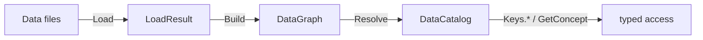
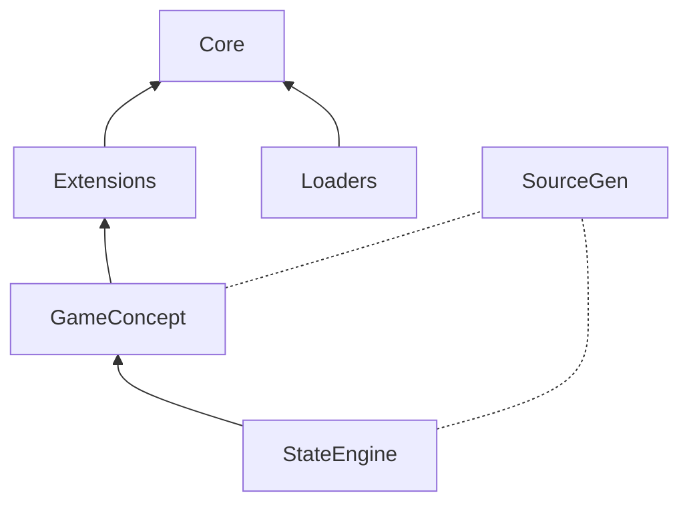

# DataCatalyst

[](https://www.nuget.org/packages/DataCatalyst/)
[](https://github.com/fm39hz/DataCatalyst/actions)
[](LICENSE)

**DataCatalyst** is a compile-time composition framework for C#/.NET. It separates code from content: C# defines infrastructure, data files define game content, and SourceGen bridges them.



---

## 💡 Philosophy

> **Code itself has no content.** Game logic, behaviors, values should never be hardcoded. Designers parameterize everything to model the world.

---

## 🚀 Quick Start

```bash
dotnet add package DataCatalyst
dotnet add package DataCatalyst.Loaders.Json
```

### 1. Define Components

```csharp
using DataCatalyst.Abstractions;

[DataComponent]
public struct Health { public float Current; public float Max; }
[DataComponent]
public struct CombatStats { public float AttackPower; public float Defense; }
```

### 2. Write Data

`Data/Goblin.json`:

```json
{
	"Health": { "Current": 50, "Max": 50 },
	"CombatStats": { "AttackPower": 8, "Defense": 5 }
}
```

### 3. Load, Resolve, Access

```csharp
using System.Text.Json;
using DataCatalyst.Core;
using DataCatalyst.Loaders;

var options = new JsonSerializerOptions { TypeInfoResolver = new DefaultJsonTypeInfoResolver() };
var result   = JsonDataLoader.LoadDirectory("Data", options);
var graph    = DataGraphBuilder.Build(result.Entries);
var catalog  = DataCatalogBuilder.Resolve(graph);

var hp  = catalog.Get<Health>(Keys.Goblin);       // compile-time safe
var atk = catalog.Get<CombatStats>(Keys.Goblin);

// Or scoped by concept
var enemies = catalog.GetConcept<EnemyConcept>();
var gobHp   = enemies.Get<Health>(Keys.Goblin);    // only Enemy entries
```

`Keys.Goblin`, `Keys.IronSword` are `public const int` generated by SourceGen from file names. Entry key typos are compile-time errors.

---

## 📦 Packages

```bash
dotnet add package DataCatalyst                              # SourceGen
dotnet add package DataCatalyst.Loaders.Json                  # JSON loader
dotnet add package DataCatalyst.Extensions                    # Compare, Composition, Materialization

dotnet add package DataCatalyst.Plugins.GameConcept
dotnet add package DataCatalyst.Plugins.GameConcept.SourceGen
dotnet add package DataCatalyst.Plugins.StateEngine
dotnet add package DataCatalyst.Plugins.StateEngine.SourceGen
```

SourceGen packages as analyzers:

```xml
<PackageReference Include="..." OutputItemType="Analyzer" ReferenceOutputAssembly="false" />
```

---

## 🏗️ Architecture

```
Abstractions/     Contracts, attributes, interfaces
Core/             Pipeline engine (Load → Graph → Catalog)
Extensions/       Compare, Composition, Materialization
Loaders.Json/     JSON loader
SourceGen/        Compile-time generators

Plugins.GameConcept/     Game concept scoped entry access (+ SourceGen)
Plugins.StateEngine/     Data-driven FSM (+ SourceGen), depends on GameConcept
```



---

## 🧩 API

### Attributes

| Attribute                                    | Target               | Meaning           | SourceGen                              |
| -------------------------------------------- | -------------------- | ----------------- | -------------------------------------- |
| `[DataComponent]`                            | `struct` with fields | Data schema       | `PrimitiveRegistry` registrations      |
| `[DataConcept("name")]`                      | `record struct`      | Concept grouping  | `ConceptRegistry` registrations        |
| `[DataConcept("name", Kind = State/Sensor)]` | `enum`               | State/sensor type | `IStateMapper<T>` / `ISensorMapper<T>` |
| `[DataPlugin]`                               | `class : IPlugin`    | Pipeline plugin   | `PluginRegistry` registrations         |

```csharp
// Data schema
[DataComponent] public struct Health { public float Current; public float Max; }

// Concept grouping
[DataConcept("Weapon")] public readonly record struct WeaponConcept;
[DataConcept("Currency")] public readonly record struct CurrencyConcept;

// State machine types
[DataConcept("AIState", Kind = ConceptKind.State)]   public enum AIState { Idle, Patrol, Attack }
[DataConcept("AISensor", Kind = ConceptKind.Sensor)] public enum AISensor { PlayerDistance, Alert }

// Plugin
[DataPlugin] public class MyPlugin : ICatalogPlugin { }
```

### Pipeline

| Type                    | API                                                                               |
| ----------------------- | --------------------------------------------------------------------------------- |
| `DataEntry`             | `Key`, `Inherits`, `Components`, `SourceFile`, `Layer`, `Get<T>()`, `TryGet<T>()` |
| `DataGraph`             | `Entries` (mutable)                                                               |
| `DataCatalog`           | `Entries` (read-only), `Get<T>(key)`, `TryGet<T>(key)`, `ContainsKey(key)`        |
| `DataCatalogExtensions` | `Bind<TKey, TComponent>(selector)`                                                |
| `DataGraphBuilder`      | `Build(entries, diagnostics?, env?)`                                              |
| `DataCatalogBuilder`    | `Resolve(graph, diagnostics?, env?)`                                              |

```csharp
// Single entry
var hp = catalog.Get<Health>(Keys.Goblin);

// Bulk
var allHealth = catalog.Bind<string, Health>(h => h.Key);
var goblinHp = allHealth[Keys.Goblin];
```

### Plugin System

```csharp
public interface IPlugin {
    bool IsEnabled { get; }
    void OnLoad();           // after registration, before pipeline
}
public interface IPluginInit : IPlugin {
    void OnPluginInit();     // pipeline ready
}
public interface IPluginCleanup : IPluginInit {
    void OnPluginCleanup();  // pipeline shutdown
}
```

| Hook              | Called                | Input                      |
| ----------------- | --------------------- | -------------------------- |
| `IPostLoadPlugin` | After load            | `IReadOnlyList<DataEntry>` |
| `IGraphPlugin`    | After graph build     | `DataGraph`                |
| `ICatalogPlugin`  | After catalog resolve | `DataCatalog`              |

Plugin ordering via `[DataPlugin(DependsOn = [typeof(OtherPlugin)])]` - topological sort at runtime.

### Extensions

| Namespace                                 | Types                                                                              |
| ----------------------------------------- | ---------------------------------------------------------------------------------- |
| `DataCatalyst.Extensions.Compare`         | `CompareOp`, `OperatorParser`                                                      |
| `DataCatalyst.Extensions.Composition`     | `TransitionDef`, `ConditionGroupDef`, `SensorConditionDef`, `SensorInfluenceDef`   |
| `DataCatalyst.Extensions.Materialization` | `DataMaterializer<T>`, `ComponentMaterializer<TC,TT>`, `IComponentMaterializer<T>` |

---

## 🔌 GameConcept

Game designers think in domains: "my game has **weapons**, **currency**, **skills**, **combat**." GameConcept lets you declare these as typed, data-driven groupings - not ECS tags, not Godot groups, not entity IDs.

```csharp
using DataCatalyst.Plugins.GameConcept;

[DataConcept("Weapon")]  public readonly record struct WeaponConcept;
[DataConcept("Currency")] public readonly record struct CurrencyConcept;
```

SourceGen auto-registers them in `ConceptRegistry.Default`. Map entries at runtime:

```csharp
var plugin = new GameConceptPlugin();
plugin.RegisterEntries<WeaponConcept>(Keys.IronSword, Keys.BattleAxe);
plugin.RegisterEntries<CurrencyConcept>(Keys.Gold, Keys.Silver);
plugin.OnCatalogResolved(catalog, diagnostics);
```

Or load from JSON - designer-managed:

```json
{ "Weapon": ["IronSword", "BattleAxe"], "Currency": ["Gold", "Silver"] }
```

```csharp
plugin.LoadConcepts("Data/concepts.json");
```

Access - scoped by concept:

```csharp
var weapons   = catalog.GetConcept<WeaponConcept>();
var currencies = catalog.GetConcept<CurrencyConcept>();
var swordAtk = weapons.Get<CombatStats>(Keys.IronSword);
var goldVal  = currencies.Get<Value>(Keys.Gold);
```

---

## 🔌 StateEngine

Data-driven hierarchical FSM. Depends on GameConcept for `[DataConcept]` attribute - state/sensor enums are concepts too.

```csharp
using DataCatalyst.Plugins.GameConcept;

[DataConcept("AIState", Kind = ConceptKind.State)]
public enum AIState { Idle, Patrol, Attack, Flee }

[DataConcept("AISensor", Kind = ConceptKind.Sensor)]
public enum AISensor { PlayerDistance, HealthPercent, Alert }
```

SourceGen generates `IStateMapper<AIState>` + `ISensorMapper<AISensor>` and registers them in `MapperRegistry.Default`.

```json
{
	"GroupId": "Locomotion",
	"DefaultState": "Idle",
	"States": {
		"Idle": {
			"Transitions": [
				{
					"TargetState": "Patrol",
					"Priority": 5,
					"Conditions": {
						"All": [
							{
								"Signal": "PlayerDistance",
								"Op": "<",
								"Value": 10
							}
						]
					}
				}
			]
		}
	}
}
```

```csharp
using DataCatalyst.Plugins.StateEngine.Core;

var baked = StateEngineBaker.Bake<AIState, AISensor>(
    catalog.Get<StateGroup>(Keys.Locomotion));

var result = StateEngineEvaluator<AIState, AISensor>.Evaluate(
    currentStateId: AIState.Idle,
    group: baked,
    viableStates: new HashSet<AIState> { AIState.Patrol, AIState.Attack },
    readSensor: sensor => sensor switch {
        AISensor.PlayerDistance => entity.DistanceToPlayer,
        AISensor.HealthPercent  => entity.Health / entity.MaxHealth,
        _ => 0f
    });

if (result.HasValue) entity.TransitionTo(result.TargetStateId);
```

`StateEnginePlugin` declares dependency via `DependsOn`:

```csharp
[DataPlugin(DependsOn = [typeof(GameConceptPlugin)])]
public sealed class StateEnginePlugin : ICatalogPlugin { ... }
```

StateEngine uses `[DataConcept(Kind = State/Sensor)]` defined in GameConcept to auto-generate mappers. GameConcept is resolved first at runtime.

---

## ⚡ SourceGen

| Generator               | Scans                                         | Produces                               |
| ----------------------- | --------------------------------------------- | -------------------------------------- |
| `ComponentGenerator`    | `[DataComponent]` structs                     | `PrimitiveRegistry` registrations      |
| `PluginGenerator`       | `IPlugin` classes                             | `PluginRegistry` registrations         |
| `EntryKeysGenerator`    | Data file names                               | `Keys.{FileName}` constants            |
| `ConceptGenerator`      | `[DataConcept("name")]` on structs            | `ConceptRegistry` registrations        |
| `StateMachineGenerator` | `[DataConcept(Kind = State/Sensor)]` on enums | `IStateMapper<T>` + `ISensorMapper<T>` |

---

## ⚖️ License

Distributed under the MIT License. See [LICENSE](LICENSE).
