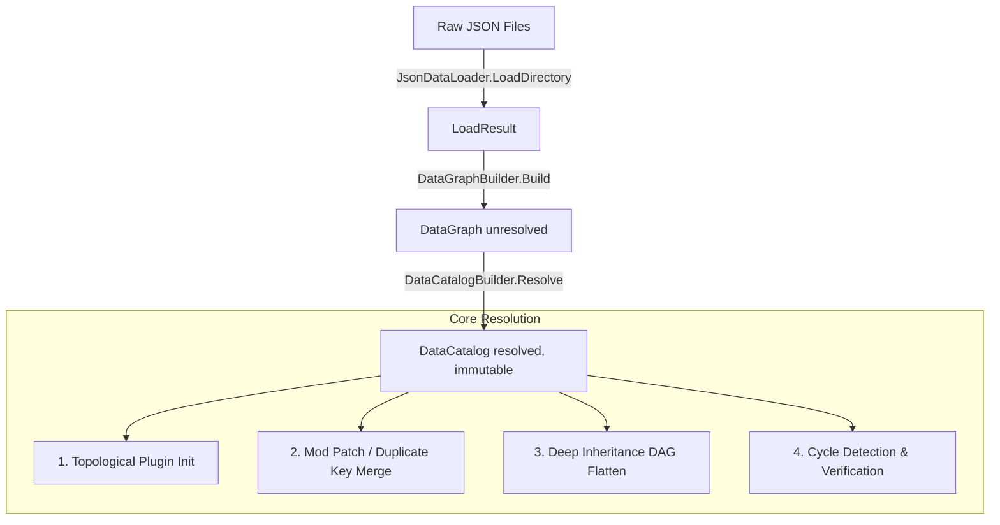

# DataCatalyst

[](https://www.nuget.org/packages/DataCatalyst/)
[](https://github.com/fm39hz/DataCatalyst/actions)
[](LICENSE)

**DataCatalyst** is a foundational, compile-time composition framework for C# and .NET. It enforces a strict separation
of concerns: **Code defines mechanism, Data defines content.**

---

## 💡 Philosophy & Core Vision

> **Code itself has no content.** Game logic, behaviors, and content values should never be hardcoded.

DataCatalyst is:

- 🚫 **NOT** a serializer.
- 🚫 **NOT** a behavior engine.
- 🚫 **NOT** a Domain-Specific Language (DSL).

It is a **pure infrastructure layer** that is completely mechanics-agnostic. How the resolved composition is utilized is
entirely up to the consumer (e.g., your game engine or ECS runtime).

### 🔌 Modding & Patch Composition

DataCatalyst is designed from the ground up for modularity and mod compatibility. It behaves similarly to **SMAPI's
ContentPatcher**:

- **Base Content**: Base game data is defined as a series of JSON files representing entities, items, or states.
- **Mod Patches**: Mods can supply their own JSON files. If a mod file declares an entry with the same key (e.g.,
  `Entities.Goblin`), DataCatalyst automatically **merges** the components.
- **Component-Level Overrides**: Mod components overwrite existing base components or append new ones deterministically
  based on the loading order.
- **No C# Recompilation**: Designers and modders can alter composition, override values, and inject data without
  changing a single line of C# code.

---

## 🏗️ Project Architecture

DataCatalyst is divided into small, focused modules to keep the core generic and lightweight:

```
├── DataCatalyst.Abstractions   - [DataComponent], [DataPlugin], DataKey<T>, and contracts
├── DataCatalyst.Core           - Registry stores, Graph and Catalog builders, composition engine
├── DataCatalyst.SourceGen      - Roslyn Incremental Generator for static AOT/Trim registration
├── DataCatalyst.Loaders.Json   - AOT-safe JSON file loader
└── DataCatalyst.Plugins.*      - Composable infrastructure plugins
    ├── NumericCompare          - Operator parser and threshold evaluation contract
    ├── Transition              - Transition and sensor condition data models
    ├── StateEngine            - Generic data-driven state machine evaluator
    └── Materializer           - Generic DataEntry-to-target materialization API
```

### 🔁 Data Flow Pipeline



---

## 🚀 Getting Started

### 1. Installation

Add the core packages to your projects. For central package versioning, add them to your `Directory.Build.props` or
reference them directly:

```bash
# Compile-time Source Generator
dotnet add package DataCatalyst

# Runtime engine & default JSON loader (transitively pulls Abstractions and Core)
dotnet add package DataCatalyst.Loaders.Json

# Optional StateEngine plugin (transitively pulls NumericCompare and Transition)
dotnet add package DataCatalyst.Plugins.StateEngine
```

### 2. Define Components (C#)

Mark any plain struct as a component using the `[DataComponent]` attribute. The Source Generator will automatically
discover it.

```csharp
using DataCatalyst.Abstractions;

namespace MyGame.Components;

[DataComponent]
public struct Health
{
    public float Current { get; init; }
    public float Max { get; init; }
}

[DataComponent]
public struct CombatStats
{
    public float AttackPower { get; init; }
    public float Defense { get; init; }
}
```

### 3. Compose Entries (JSON)

Compose your entities in JSON files. They can inherit from parents and override specific components.

`Data/BaseMonster.json`:

```json
{
	"Health": {
		"Current": 100,
		"Max": 100
	},
	"CombatStats": {
		"AttackPower": 10,
		"Defense": 5
	}
}
```

`Data/Goblin.json` (inherits from `BaseMonster` and overrides `Health` max, inheriting `CombatStats` automatically):

```json
{
	"inherits": ["BaseMonster"],
	"Health": {
		"Current": 50,
		"Max": 50
	}
}
```

### 4. Load and Resolve

Run the resolution pipeline at startup to build your resolved, immutable data catalog:

```csharp
using System.Text.Json;
using System.Text.Json.Serialization.Metadata;
using DataCatalyst.Core;
using DataCatalyst.Loaders;

// Configure JSON serialization options for Native AOT (e.g. using source-generated contexts)
var options = new JsonSerializerOptions
{
    TypeInfoResolver = new DefaultJsonTypeInfoResolver()
};

// 1. Load raw entries (supports both directory loading and single-file array catalogs)
var loadResult = JsonDataLoader.LoadArray("Data/substances.json", "id", options);

// 2. Build the unresolved graph (automatically merges duplicate keys/mods)
var graph = DataGraphBuilder.Build(loadResult.Entries);

// 3. Resolve composition (processes inheritance, flattens hierarchies, and checks for cycles)
var catalog = DataCatalogBuilder.Resolve(graph);

// 4. Access specific entries by key — return values are typed structs
var goblinHealth = catalog.Get<Health>("Goblin");  // 50/50 (overridden)
var goblinStats = catalog.Get<CombatStats>("Goblin"); // 10/5 (inherited from BaseMonster)

// 5. Or bind resolved components to typed dictionaries using DataKey<T>
var substances = catalog.Bind<DataKey<SubstanceData>, SubstanceData>(c => new DataKey<SubstanceData>(c.Name));
```

---

## ⚡ Native AOT & Trim Safety

DataCatalyst is engineered for **Native AOT (Ahead-of-Time) compilation** and strict trimming (essential for modern
high-performance game runtimes such as Godot 4 .NET, Unity, or custom engines):

- **Zero Runtime Reflection**: The Roslyn source generator (`DataCatalyst.SourceGen`) scans your assemblies at compile
  time and registers component types inside a single static `[ModuleInitializer]` method.
- **Compile-Time Discriminator Mapping**: JSON property names are resolved against a source-generated dictionary using
  the type's short name as the discriminator — no runtime `Type.Name` dictionary building at load time.
- **Explicit Type Resolution**: No runtime JSON type-name scanning. Components are resolved against statically
  registered types.
- **Trim-Safe Serialization**: `JsonDataLoader` accepts `JsonSerializerOptions` to integrate seamlessly with
  `System.Text.Json` source-generated serialization contexts.

---

## 📦 Bundled Infrastructure Plugins

DataCatalyst includes pure data-driven plugins for common game patterns:

### 🧩 Materializer Plugin

Provides a generic `DataEntry`-to-target materialization API decoupled from any ECS framework:

- **`DataMaterializer<TTarget>`**: Registry and dispatcher for component materializers targeting any consumer type.
- **`ComponentMaterializer<TComponent, TTarget>`**: Wraps an `Action<TTarget, TComponent>` to extract a typed component from a `DataEntry` and apply it to a target.
- **Native AOT-safe**: Pure generic delegates, zero reflection, consumer-defined bindings.

```csharp
var materializer = new DataMaterializer<Entity>();
materializer.Register<Health>((entity, hp) => entity.SetHealth(hp.Current, hp.Max));
materializer.Register<CombatStats>((entity, s) => entity.SetCombat(s.AttackPower, s.Defense));

foreach (var (key, entry) in catalog.Entries)
{
    var entity = new Entity();
    materializer.Materialize(entry, entity);
}
```

### 🎮 StateEngine & Transition Plugins

Provides a generic, priority-based hierarchical state machine evaluator. It calculates transitions based on sensor
inputs completely from data:

- **Transitions**: Priority-based edges from a source state to a target state.
- **Conditions**: Supports `All` (AND), `Any` (OR), and `None` (NOT) condition groups.
- **Hysteresis**: Supports separate entry `Value` and `ExitValue` parameters on conditions to prevent rapid flickering
  between states.
- **Hierarchical States**: State definitions can specify a `Parent`. If child transition conditions are not met, the
  evaluator automatically falls back to parent transitions.
- **Depth Penalty**: A penalty applied to parent transition priorities so that more specific child transitions win when
  competing.
- **Dynamic Influences**: Priorities can be dynamically modified by multiplying sensor values by configured weights.

```csharp
// 1. Bake the raw StateGroup at startup to flatten hierarchy, pre-calculate priorities,
// and map string identifiers to generic GameStateKind and GameSensorKind enums.
var bakedGroup = StateEngineBaker.Bake<GameStateKind, GameSensorKind>(
    catalog.Get<StateGroup>("Locomotion"),
    stateStr => MapStringToStateEnum(stateStr),
    sensorStr => MapStringToSensorEnum(sensorStr)
);

// 2. Evaluate transitions dynamically in the physics/update loop with ZERO heap allocations
// and ZERO string comparisons.
var result = StateEngineEvaluator<GameStateKind, GameSensorKind>.Evaluate(
    currentStateId: GameStateKind.Idle,
    group: bakedGroup,
    viableStates: activeViableStates,
    readSensor: sensorEnum => entity.GetSensorValue(sensorEnum)
);

if (result.HasValue)
{
    entity.TransitionTo(result.TargetStateId);
}
```

---

## ⚖️ License

Distributed under the MIT License. See [LICENSE](LICENSE) for more information.
