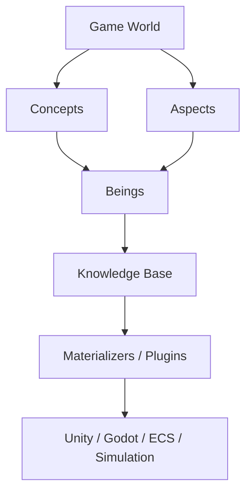
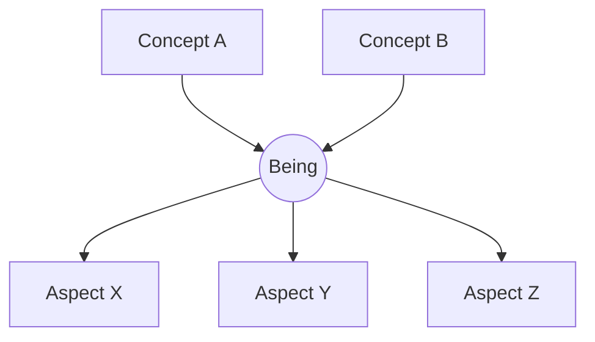
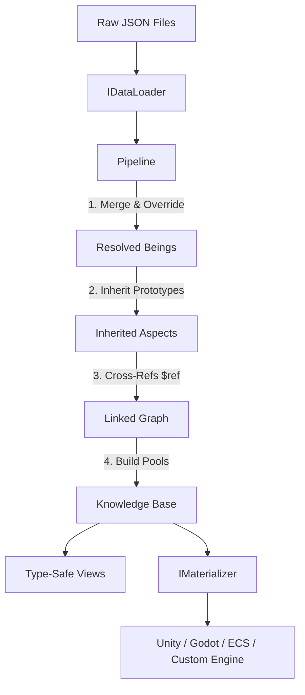
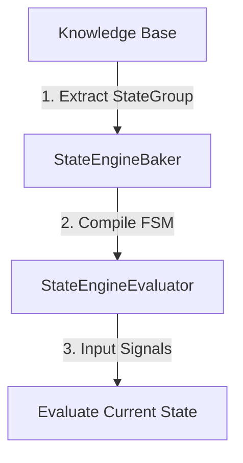

# DataCatalyst

[](https://www.nuget.org/packages/DataCatalyst/)
[](https://github.com/fm39hz/DataCatalyst/actions)
[](LICENSE)

Game modeling framework for C#/.NET.

---

> **Code itself has no game specific content.** Game logic, behaviors, values, etc... should never be hardcoded. Designers parameterize everything to model the world.

---

### High-Level Overview



---

## 🧬 Core Idea

Everything in DataCatalyst is built from three primitives: **Aspect**, **Being**, and **Concept** (the ABC model).

### The ABC Model



- **Aspect**: An aspect of a being (e.g., `Health`, `CombatStats`). It defines a specific facet of data.
- **Being**: A being that exists in the game world (e.g., `Goblin`, `Arthur`).
- **Concept**: A concept that defines the nature or identity of a being (e.g., `Creature`, `Enemy`, `Hero`).

### Orthogonality

For example, the being `Goblin` belongs to 2 Concepts (`Creature`, `Enemy`) and has 5 Aspects (`Health`, `CombatStats`, `PatrolRadius`, `Stamina`, `Mana`). Since `Stamina` and `Mana` are being-level aspects, they do not belong to the concept definitions but are still possessed by the being. Connecting these coordinate points on the XY axes reveals the closed geometric shape of the `Goblin` being:


### Mathematical Model

Mathematically, the game design database is a space defined by two orthogonal axes:

- **Concept Axis ($C$)**: The space of Concepts. A Being $B$ must map to at least one Concept ($|Concepts(B)| \ge 1$).
- **Aspect Axis ($A$)**: The space of Aspects. Aspects are free-floating and can belong to a Being directly or connect to a Concept.

A Being $B_i$ is a coordinate point in the Cartesian product of the Concept power set and Aspect power set:

```math
B_i = (C_{B_i}, A_{B_i}) \quad \text{where} \quad C_{B_i} \subseteq C, \ A_{B_i} \subseteq A
```

---

## 🚀 Quick Start

### 1. Install

```bash
dotnet add package DataCatalyst
dotnet add package DataCatalyst.Loaders.Json
```

### 2. Write Data

`Data/Creatures.json`:

```json
{
	"Goblin": {
		"$Creature": {
			"Health": { "Initial": 40, "Max": 40 },
			"CombatStats": { "BaseDamage": 6, "BaseDefense": 3 }
		},
		"$Enemy": {}
	}
}
```

### 3. Declare Concepts & Aspects

```csharp
[GameConcept]
public record struct Creature : IConcept;

[GameConcept]
public record struct Enemy : IConcept;

[GameAspect]
public record struct Health { public int Initial; public int Max; }

[GameAspect]
public record struct CombatStats { public int BaseDamage; public int BaseDefense; }
```

### 4. Load, Build & Query

```csharp
// Simple fluent API, mix & match your source
Knowledge knowledge = new Pipeline()
    .AddSource("Base", new JsonDataLoader(), "Data/")
    .Build(out var diagnostics);

// Access - type-safe and compile-time checked
int hp  = knowledge.Of<Creature>().At<Goblin>().Take<Health>().Initial;
int atk = knowledge.Of<Enemy>().At<Goblin>().Take<CombatStats>().BaseDamage;
```

`Goblin` is a generated `being` marker type implementing `IBelongTo<Creature>`, `IBelongTo<Enemy>`.

---

## 🏗️ Architecture

DataCatalyst processes your design GDD database through a statically resolved compilation pipeline, converting raw files into highly optimized flat memory layouts.



---

## 🧩 Usage

The framework workflow is divided into four main phases: **Model**, **Compose**, **Access**, and **Integrate**.

---

### 1. Model

Define your concepts, aspects, and beings to map out the structure of your game.

#### Concept

A Concept represents semantic classification. It is a marker type defined as a C# struct.

```csharp
[GameConcept]
public record struct Creature : IConcept;
```

#### Aspect

An Aspect is a modular data struct attached to concepts or beings.

```csharp
[GameAspect]
public record struct Health { public int Initial; public int Max; }
```

---

### 2. Compose

Leverage prototype inheritance and cross-references to assemble complex data profiles with minimal repetition.

#### Prototype Inheritance (`$inherits` / `inherits`)

Beings can inherit aspect values from another being. Unspecified fields in the child being fall back to the parent being's values.

```json
{
	"BaseMonster": {
		"$Creature": {
			"Health": { "Initial": 100, "Max": 100 }
		}
	},
	"Goblin": {
		"$inherits": "BaseMonster",
		"$Creature": {
			"Health": { "Initial": 40 }
		}
	}
}
```

_Result: `Goblin` overrides `Health.Initial` to `40`, inheriting `Health.Max` as `100`._

#### Cross-Reference (`$ref`)

You can reference other beings using the `"$ref"` key. The pipeline resolves these references at build time, replacing the reference object with the target being's key string.

```json
{
	"Goblin": {
		"$Creature": {
			"InitialWeapon": { "WeaponId": { "$ref": "WoodenClub" } }
		}
	}
}
```

_At runtime, `InitialWeapon` will be resolved to `"WoodenClub"`._

---

### 3. Access

Query and traverse the compiled database using highly optimized, type-safe APIs.

#### Knowledge & Views

The final result of the pipeline is a `Knowledge` instance containing fast, flat-array storage pools.

```csharp
// Direct lookup
var goblin = knowledge.Of<Creature>().At<Goblin>();
int maxHp = goblin.Take<Health>().Max;

// Concept-scoped view
var creatures = knowledge.Of<Creature>();
foreach (var record in BeingRegistry.All) {
    if (creatures.Has(record.BeingType)) {
        // Process creature beings
    }
}
```

---

### 4. Integrate

Bridge the engine-agnostic database to your specific game loader and engine objects.

#### Loader

Implement `IDataLoader` to support formats like CSV, YAML, MsgPack, etc.

```csharp
public class CsvDataLoader : IDataLoader {
    public LoadResult Load(string content, string fallbackKey) {
        var result = new LoadResult();
        // Parse CSV string content -> RawBeing
        return result;
    }
    public LoadResult LoadFile(string path) => Load(File.ReadAllText(path), Path.GetFileNameWithoutExtension(path));
    public LoadResult LoadDirectory(string path) {
        var result = new LoadResult();
        foreach (var file in Directory.EnumerateFiles(path, "*.csv")) {
            result._beings.AddRange(LoadFile(file)._beings);
        }
        return result;
    }
}
```

#### Materializer

Bridge DataCatalyst's `Knowledge` to engine-specific game objects or entities. Define a pattern once, and SourceGen dispatches all aspects automatically.

```csharp
[Materializer]
partial class EcsMaterializer : IMaterializer<Entity> {
    readonly Knowledge _k;
    void Apply<T>(Entity e, T c) where T : struct => _k.Add(e, c);
}

// Usage in Game Loop (Unity, Godot, ECS, etc.)
var mat = new EcsMaterializer(knowledge);
mat.Apply(entity, knowledge.Of<Creature>().At<Goblin>());
```

---

## 🔌 Bundled Plugin

### StateEngine

StateEngine is a data-driven hierarchical FSM. States, signals, and transitions are defined as data, allowing you to modify behaviors without editing code.



#### Write State Data

```json
{
	"goblinAI": {
		"$LocomotionStates": {
			"stateGroup": {
				"groupId": "GoblinAI",
				"defaultState": "Patrol",
				"states": {
					"patrol": {
						"transitions": [
							{
								"targetState": "Chase",
								"priority": 100,
								"conditions": {
									"all": [
										{
											"signal": "PlayerDistance",
											"op": "<",
											"value": 8
										}
									]
								}
							}
						]
					}
				}
			}
		}
	}
}
```

#### Bake & Evaluate FSM

```csharp
// Bake - resolve string names to int IDs
var baked = StateEngineBaker.Bake(
    knowledge.Of<LocomotionStates>().At<GoblinAI>().Take<StateGroup>(),
    knowledge
);

// Evaluate - ONE engine for ALL entities
var result = StateEngineEvaluator.Evaluate(
    baked.DefaultStateId, baked, viableStates,
    signalId => signalId switch {
        PlayerDistance => entity.DistanceToPlayer,
        _ => 0f
    });
```

---

## 📦 Packages

DataCatalyst is modular, letting you install only the components your project needs.

```bash
dotnet add package DataCatalyst                               # SourceGen + Core
dotnet add package DataCatalyst.Loaders.Json                  # JSON loader
dotnet add package DataCatalyst.Extensions                    # Compare, Composition, Materialization
dotnet add package DataCatalyst.Plugins.StateEngine
dotnet add package DataCatalyst.Plugins.StateEngine.SourceGen
```

SourceGen packages can be registered as analyzers in C# project files:

```xml
<PackageReference Include="DataCatalyst.SourceGen" OutputItemType="Analyzer" ReferenceOutputAssembly="false" />
```

---

## 🛠️ Editor

A node graph editor is currently under development but will not be finished anytime soon.

---

## ⚖️ License

Distributed under the MIT License. See [LICENSE](LICENSE)

[](https://app.repohistory.com/star-history)
