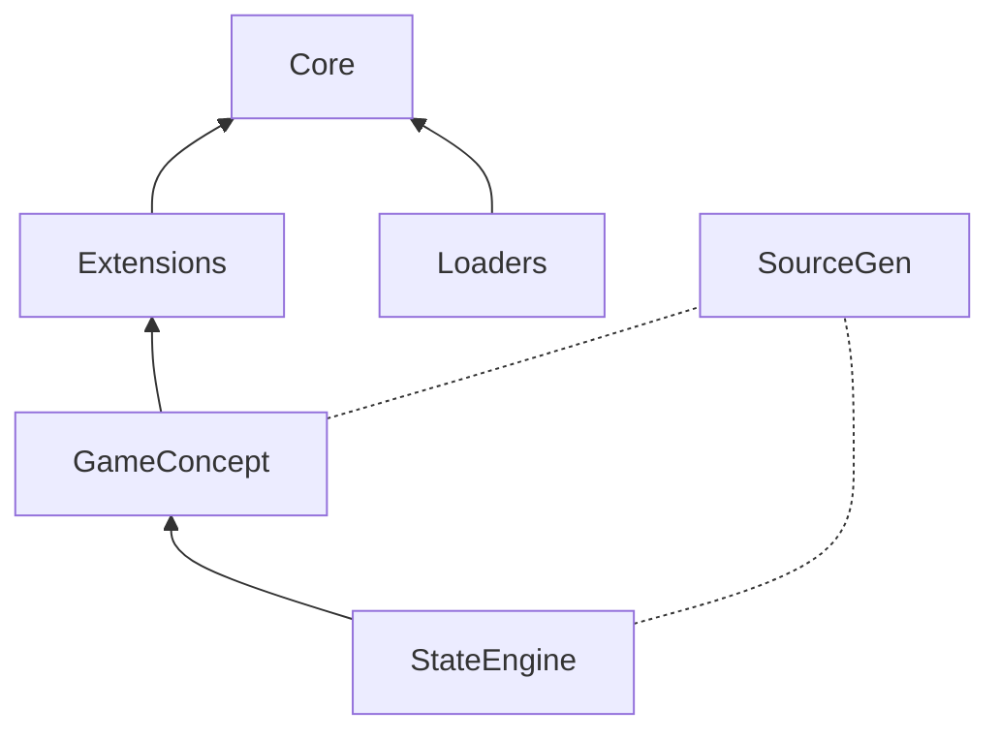

# DataCatalyst

[](https://www.nuget.org/packages/DataCatalyst/)
[](https://github.com/fm39hz/DataCatalyst/actions)
[](LICENSE)

**DataCatalyst** is a compile-time composition framework for C#/.NET. It separates code from content: C# defines infrastructure, data files define game content, and SourceGen bridges them.

> **Code itself has no content.** Game logic, behaviors, values should never be hardcoded. Designers parameterize everything to model the world.

---

## 🚀 Quick Start

```bash
dotnet add package DataCatalyst
dotnet add package DataCatalyst.Loaders.Json
```

### 1. Define Components

```csharp
using DataCatalyst.Abstractions;

[DataComponent]
public struct Health { public float Current; public float Max; }
[DataComponent]
public struct CombatStats { public float AttackPower; public float Defense; }
```

### 2. Write Data

`Data/Goblin.json`:

```json
{
	"Health": { "Current": 50, "Max": 50 },
	"CombatStats": { "AttackPower": 8, "Defense": 5 }
}
```

### 3. Load, Resolve, Access

```csharp
using System.Text.Json;
using DataCatalyst.Core;
using DataCatalyst.Loaders;

var options = new JsonSerializerOptions { TypeInfoResolver = new DefaultJsonTypeInfoResolver() };
var result   = JsonDataLoader.LoadDirectory("Data", options);
var graph    = DataGraphBuilder.Build(result.Entries);
var catalog  = DataCatalogBuilder.Resolve(graph);

var hp  = catalog.Get<Health>(Keys.Goblin);
var atk = catalog.Get<CombatStats>(Keys.Goblin);

// Or scoped by concept — type `Concept.` for IntelliSense list
var enemies = catalog.GetConcept<Concept.Enemy>();
var gobHp   = enemies.Get<Health>(Keys.Goblin);    // get only Enemy entries
```

`Keys.Goblin`, `Keys.IronSword` are `public const int` generated by SourceGen from file names. Entry key typos are compile-time errors.

---

## 📦 Packages

```bash
dotnet add package DataCatalyst                              # SourceGen
dotnet add package DataCatalyst.Loaders.Json                  # JSON loader
dotnet add package DataCatalyst.Extensions                    # Compare, Composition, Materialization

dotnet add package DataCatalyst.Plugins.GameConcept
dotnet add package DataCatalyst.Plugins.GameConcept.SourceGen
dotnet add package DataCatalyst.Plugins.StateEngine
dotnet add package DataCatalyst.Plugins.StateEngine.SourceGen
```

SourceGen packages as analyzers:

```xml
<PackageReference Include="..." OutputItemType="Analyzer" ReferenceOutputAssembly="false" />
```

---

## 🏗️ Architecture

```
Abstractions/     Contracts, attributes, interfaces
Core/             Pipeline engine (Load → Graph → Catalog)
Extensions/       Compare, Composition, Materialization
Loaders.Json/     JSON loader
SourceGen/        Compile-time generators

Plugins.GameConcept/     Game concept scoped entry access (+ SourceGen)
Plugins.StateEngine/     Data-driven FSM (+ SourceGen), depends on GameConcept
```



---

## 🧩 Core API

### Pipeline Types

| Type                 | API                                                                               |
| -------------------- | --------------------------------------------------------------------------------- |
| `DataEntry`          | `Key`, `Inherits`, `Components`, `SourceFile`, `Layer`, `Get<T>()`, `TryGet<T>()` |
| `DataGraph`          | `Entries` (read-only), `MutableEntries` (internal)                                |
| `DataCatalog`        | `Entries` (read-only), `Get<T>(int)`, `Get<T>(string)`, `Bind<TKey,T>()`          |
| `DataGraphBuilder`   | `Build(entries, diagnostics?, env?)` - layer-aware merge                          |
| `DataCatalogBuilder` | `Resolve(graph, diagnostics?, env?)` - inheritance flatten + cycle detect         |

```csharp
var hp   = catalog.Get<Health>(Keys.Goblin);
var all  = catalog.Bind<string, Health>(h => h.Key);
var gobHp = all[Keys.Goblin];
```

### Core Attributes

| Attribute         | Target               | Meaning         | SourceGen                         |
| ----------------- | -------------------- | --------------- | --------------------------------- |
| `[DataComponent]` | `struct` with fields | Data schema     | `PrimitiveRegistry` registrations |
| `[DataPlugin]`    | `class : IPlugin`    | Pipeline plugin | `PluginRegistry` + `LoadAll()`    |

### Registries

| Registry            | Auto-populated by                       | Manual                                    |
| ------------------- | --------------------------------------- | ----------------------------------------- |
| `PluginRegistry`    | SourceGen (topo-sorted via `DependsOn`) | `Register(type, instance)`, `Diagnostics` |
| `PrimitiveRegistry` | SourceGen (`[DataComponent]`)           | `Register<T>()`, `ResolveId(id)`          |
| `ServiceRegistry`   | -                                       | `Register<T>(service)`, `Get<T>()`        |
| `MapperRegistry`    | Plugin SourceGens                       | `Register<T>(mapper)`, `Get<T>()`         |

### Plugin System

```csharp
public interface IPlugin {
    bool IsEnabled { get; }
    void OnLoad();
}
public interface IPluginInit : IPlugin {
  void OnPluginInit();
}
public interface IPluginCleanup : IPluginInit {
  void OnPluginCleanup();
}
```

| Hook              | Called                | Input                      |
| ----------------- | --------------------- | -------------------------- |
| `IPostLoadPlugin` | After load            | `IReadOnlyList<DataEntry>` |
| `IGraphPlugin`    | After graph build     | `DataGraph`                |
| `ICatalogPlugin`  | After catalog resolve | `DataCatalog`              |

```csharp
[DataPlugin]
public class MyPlugin : ICatalogPlugin;

[DataPlugin(DependsOn = [typeof(OtherPlugin)])]
public class DepPlugin : ICatalogPlugin;
```

### Extensions

| Namespace                                 | Types                                                                              |
| ----------------------------------------- | ---------------------------------------------------------------------------------- |
| `DataCatalyst.Extensions.Compare`         | `CompareOp`, `OperatorParser`, `DefaultEpsilon`                                    |
| `DataCatalyst.Extensions.Composition`     | `TransitionDef`, `ConditionGroupDef`, `SensorConditionDef`, `SensorInfluenceDef`   |
| `DataCatalyst.Extensions.Materialization` | `DataMaterializer<T>`, `ComponentMaterializer<TC,TT>`, `IComponentMaterializer<T>` |

---

## Bundled Plugins

This come with some opiniated plugins

### 🔌 GameConcept

Game designers think in domains: "my game has **weapons**, **currency**, **skills**, **combat**, etc..." GameConcept lets you declare these as typed, data-driven groupings - not ECS tags, not Godot groups, not entity IDs: It is GDD as code, the vocabulary of your games.

#### Plugin Attributes

| Attribute                                   | Target            | Meaning            | Processed by          |
| ------------------------------------------- | ----------------- | ------------------ | --------------------- |
| `[DataConcept("name")]`                     | `record struct`   | Concept grouping   | GameConcept.SourceGen |
| `[DataConcept("name", Kind = typeof(...))]` | `enum`            | Typed enum concept | Plugin SourceGens     |
| `[DataPlugin]`                              | `class : IPlugin` | Pipeline hook      | PluginGenerator       |

`Kind` is an optional marker Type - not a value. Plugins define their own marker structs (or use GameConcept built-in ones). GameConcept processes structs (Kind = null). Enums with `[DataConcept]` are processed by plugin SourceGens.

#### Data-driven concept declaration

Write `concepts.json` - SourceGen generates phantom structs automatically:

```json
{
	"Weapon": { "description": "Equipable weapon" },
	"Currency": { "description": "The currency concern in this game" }
}
```

```csharp
var weapons = catalog.GetConcept<Concept.Weapon>();
```

Or declare manually — add to `public static partial class Concept { ... }`:

```csharp
public static partial class Concept {
    [DataConcept("Weapon")] public readonly partial struct Weapon;
}
```

Both paths register in `ConceptRegistry.Default`. Entry membership comes from the `"concept"` field in each entry file:

```json
{ "concept": "Enemy", "Health": { "Current": 50 } }
```

```csharp
var plugin = new GameConceptPlugin();
plugin.OnCatalogResolved(catalog, diagnostics);

var weapons   = catalog.GetConcept<Concept.Weapon>();
var swordAtk  = weapons.Get<CombatStats>(Keys.IronSword);
```

#### Kind filter

Register with optional Kind marker type - filter at runtime:

```csharp
public readonly struct PassiveKind;

[DataConcept("GuardBehavior", Kind = typeof(PassiveKind))]
public readonly record struct GuardConcept;

var kinds = registry.GetByKind<PassiveKind>();
```

---

### 🔌 StateEngine

Data-driven hierarchical FSM. Enums with `[DataConcept]` are concepts - SourceGen auto-generates mappers.

```csharp
using DataCatalyst.Plugins.GameConcept;
using DataCatalyst.Plugins.StateEngine;

[DataConcept("AIState")]
public enum AIState { Idle, Patrol, Attack, Flee }

[DataConcept("AISensor")]
public enum AISensor { PlayerDistance, HealthPercent, Alert }
```

SourceGen generates `IStateMapper<AIState>` + `ISensorMapper<AIState>` (and same for `AISensor`) and registers them in `MapperRegistry.Default`. Both mapper types are generated for every `[DataConcept]` enum - no Kind filtering needed.

```json
{
	"GroupId": "Locomotion",
	"DefaultState": "Idle",
	"States": {
		"Idle": {
			"Transitions": [
				{
					"TargetState": "Patrol",
					"Priority": 5,
					"Conditions": {
						"All": [
							{
								"Signal": "PlayerDistance",
								"Op": "<",
								"Value": 10
							}
						]
					}
				}
			]
		}
	}
}
```

```csharp
using DataCatalyst.Plugins.StateEngine.Core;

var baked = StateEngineBaker.Bake<AIState, AISensor>(
    catalog.Get<StateGroup>(Keys.Locomotion));

var result = StateEngineEvaluator<AIState, AISensor>.Evaluate(
    currentStateId: AIState.Idle,
    group: baked,
    viableStates: new HashSet<AIState> { AIState.Patrol, AIState.Attack },
    readSensor: sensor => sensor switch {
        AISensor.PlayerDistance => entity.DistanceToPlayer,
        AISensor.HealthPercent  => entity.Health / entity.MaxHealth,
        _ => 0f
    });

if (result.HasValue) entity.TransitionTo(result.TargetStateId);
```

#### Mix & Match - State + Concept

```csharp
var baked   = StateEngineBaker.Bake<AIState, AISensor>(catalog.Get<StateGroup>(Keys.Locomotion));
var enemies = catalog.GetConcept<Concept.Enemy>();

// Use baked state + concept-scoped entries together
var goblinHp = enemies.Get<Health>(Keys.Goblin);
var result   = StateEngineEvaluator<AIState, AISensor>.Evaluate(AIState.Idle, baked, ...);
```

---

## ⚖️ License

Distributed under the MIT License. See [LICENSE](LICENSE).
