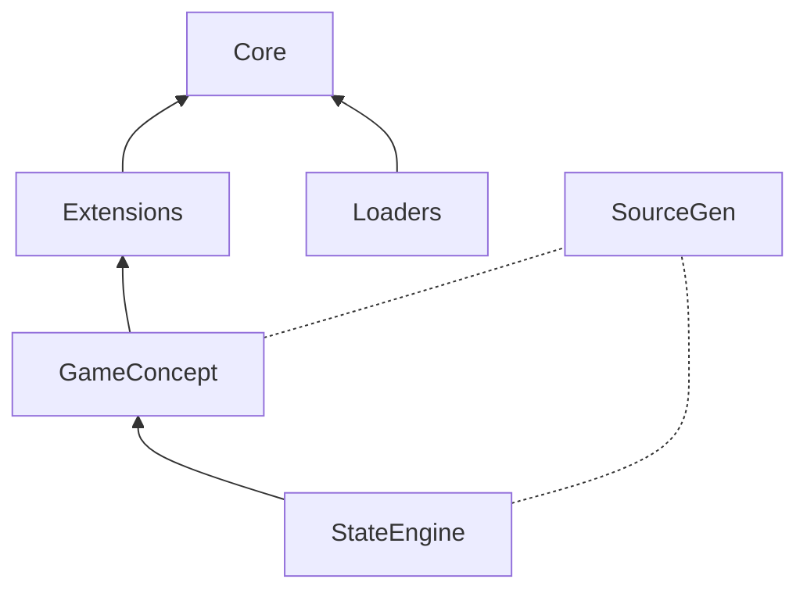

# DataCatalyst

[](https://www.nuget.org/packages/DataCatalyst/)
[](https://github.com/fm39hz/DataCatalyst/actions)
[](LICENSE)

**DataCatalyst** is a compile-time composition framework for C#/.NET. It separates code from content: C# defines infrastructure, data files define game content, and SourceGen bridges them.

> **Code itself has no content.** Game logic, behaviors, values should never be hardcoded. Designers parameterize everything to model the world.

---

## 🚀 Quick Start

```bash
dotnet add package DataCatalyst
dotnet add package DataCatalyst.Loaders.Json
```

### 1. Define Components

```csharp
using DataCatalyst.Abstractions;

[DataComponent] public struct Health { public float Current; public float Max; }
[DataComponent] public struct CombatStats { public float AttackPower; public float Defense; }
```

### 2. Write Data

`Data/Goblin.json`:

```json
{
	"Health": { "Current": 50, "Max": 50 },
	"CombatStats": { "AttackPower": 8, "Defense": 5 }
}
```

### 3. Load, Resolve, Access

```csharp
using System.Text.Json;
using DataCatalyst.Core;
using DataCatalyst.Loaders;

var options = new JsonSerializerOptions { TypeInfoResolver = new DefaultJsonTypeInfoResolver() };
var result  = JsonDataLoader.LoadDirectory("Data", options);
var graph   = DataGraphBuilder.Build(result.Entries);
var catalog = DataCatalogBuilder.Resolve(graph);

var hp  = catalog.Get<Health>(Keys.Goblin);
var atk = catalog.Get<CombatStats>(Keys.Goblin);
```

`Keys.Goblin` is a `public const int` generated by SourceGen from file names. Entry key typos are compile-time errors.

### 4. With Concepts (see [#GameConcept plugin](#🔌-gameconcept))

```bash
dotnet add package DataCatalyst.Plugins.GameConcept
dotnet add package DataCatalyst.Plugins.GameConcept.SourceGen
```

Add `"Concept"` field to data files:

```json
{ "Concept": "Enemy", "Health": { "Current": 50, "Max": 50 } }
```

Declare concepts in `concepts.json`:

```json
{ "Enemy": { "description": "Hostile entities" } }
```

SourceGen generates `Concept.Enemy.Goblin` constants. Access becomes:

```csharp
var hp = catalog.Get<Health>(Concept.Enemy.Goblin);

// Or concept-scoped access
var enemies = catalog.GetConcept<Concept.Enemy>();
var gobHp = enemies.Get<Health>(Concept.Enemy.Goblin);  // int key (concept constant)
```

---

## 📦 Packages

```bash
dotnet add package DataCatalyst                              # SourceGen
dotnet add package DataCatalyst.Loaders.Json                  # JSON loader
dotnet add package DataCatalyst.Extensions                    # Compare, Composition, Materialization

dotnet add package DataCatalyst.Plugins.GameConcept
dotnet add package DataCatalyst.Plugins.GameConcept.SourceGen
dotnet add package DataCatalyst.Plugins.StateEngine
dotnet add package DataCatalyst.Plugins.StateEngine.SourceGen
```

SourceGen packages as analyzers:

```xml
<PackageReference Include="..." OutputItemType="Analyzer" ReferenceOutputAssembly="false" />
```

---

## 🏗️ Architecture

```
Abstractions/     Contracts, attributes, interfaces
Core/             Pipeline engine (Load → Graph → Catalog)
Extensions/       Compare, Composition, Materialization
Loaders.Json/     JSON loader
SourceGen/        Compile-time generators

Plugins.GameConcept/     Game concept scoped entry access (+ SourceGen)
Plugins.StateEngine/     Data-driven FSM (+ SourceGen), depends on GameConcept
```



---

## Open features

### Loader System

Json is come as default, but you can implement any loader that you want

```csharp

public sealed class LoadResult {
	internal readonly List<DataEntry> _entries = [];
	internal readonly List<string> _diagnostics = [];
	public IReadOnlyList<DataEntry> Entries => _entries;
	public IReadOnlyList<string> Diagnostics => _diagnostics;
}

public interface IDataLoader {
	public LoadResult LoadDirectory(string path);
}
```

### Plugin System

```csharp
public interface IPlugin {
    bool IsEnabled { get; }
    void OnLoad();
}
public interface IPluginInit {
  void OnPluginInit();
}
public interface IPluginCleanup : IPluginInit {
  void OnPluginCleanup();
}
```

| Hook              | Called                | Input                      |
| ----------------- | --------------------- | -------------------------- |
| `IPostLoadPlugin` | After load            | `IReadOnlyList<DataEntry>` |
| `IGraphPlugin`    | After graph build     | `DataGraph`                |
| `ICatalogPlugin`  | After catalog resolve | `DataCatalog`              |

```csharp
[DataPlugin]
public class MyPlugin : ICatalogPlugin;

[DataPlugin(DependsOn = [typeof(OtherPlugin)])]
public class DepPlugin : ICatalogPlugin;
```

### Extensions

| Namespace                                 | Types                                                                              |
| ----------------------------------------- | ---------------------------------------------------------------------------------- |
| `DataCatalyst.Extensions.Compare`         | `CompareOp`, `OperatorParser`, `DefaultEpsilon`                                    |
| `DataCatalyst.Extensions.Composition`     | `TransitionDef`, `ConditionGroupDef`, `SensorConditionDef`, `SensorInfluenceDef`   |
| `DataCatalyst.Extensions.Materialization` | `DataMaterializer<T>`, `ComponentMaterializer<TC,TT>`, `IComponentMaterializer<T>` |

---

## Bundled Plugins

This framework come with some opiniated plugins

### 🔌 GameConcept

Game designers think in domains: "my game has **weapons**, **currency**, **skills**, **combat**, etc..." GameConcept lets you declare these as typed, data-driven groupings - not ECS tags, not Godot groups, not entity IDs: It is GDD as code, the vocabulary of your games.

#### Data-driven concept declaration

Write `concepts.json` — SourceGen generates phantom structs automatically:

```json
{
	"Enemy": { "description": "Hostile entities" },
	"Weapon": { "description": "Equipable weapons" },
	"Locomotion": { "description": "AI movement states", "kind": "States" },
	"AISensor": { "description": "AI perception inputs", "kind": "Sensor" }
}
```

Entry membership comes from the `"Concept"` field in each entry file:

```json
{ "Concept": "Enemy", "Health": { "Current": 50, "Max": 50 }, "CombatStats": { "AttackPower": 5, "Defense": 3 } }
{ "Concept": "Weapon", "Durability": { "Current": 100, "Max": 100 }, "CombatStats": { "AttackPower": 15 } }
{ "Concept": "AISensor", "DefaultValue": 999 }
```

SourceGen scans all JSON data files, groups entries by `"Concept"`, and generates entry name constants:

```csharp
// Auto-generated: ConceptsFromData.g.cs
public static partial class Concept {
    [DataConcept("Enemy")]
    public readonly partial struct Enemy {
        public const int Goblin = 0;
    }

    [DataConcept("Weapon")]
    public readonly partial struct Weapon {
        public const int IronSword = 0;
    }

    [DataConcept("Locomotion")]
    public readonly partial struct Locomotion {
        public const int Locomotion = 0;  // the state group entry itself
    }

    [DataConcept("AISensor")]
    public readonly partial struct AISensor {
        public const int PlayerDistance = 0;
    }
}
```

Or declare manually — add to `public static partial class Concept { ... }`:

```csharp
public static partial class Concept {
    [DataConcept("Weapon")] public readonly partial struct Weapon;
}
```

Both paths register in `ConceptRegistry.Default`.

```csharp
// Direct access using concept constants
var goblinHp = catalog.Get<Health>(Concept.Enemy.Goblin);
var swordAtk = catalog.Get<CombatStats>(Concept.Weapon.IronSword);

// Concept-scoped access
var enemies = catalog.GetConcept<Concept.Enemy>();
var gobHp = enemies.Get<Health>(Concept.Enemy.Goblin);  // int key (concept constant)
```

---

### 🔌 StateEngine

Data-driven hierarchical FSM. States and signals are concepts — nothing special. They are defined in `concepts.json` and declared in data files using the `"Concept"` field, just like any other entry.

#### State machine data

`Data/Locomotion.json`:

```json
{
	"Concept": "Locomotion",
	"DefaultState": "Idle",
	"States": {
		"Idle": {
			"Transitions": [
				{
					"TargetState": "Walk",
					"Priority": 5,
					"Conditions": {
						"All": [
							{
								"Signal": "PlayerDistance",
								"Op": "<",
								"Value": 20
							}
						]
					}
				}
			]
		},
		"Walk": {
			"Transitions": [
				{
					"TargetState": "Chase",
					"Priority": 10,
					"Conditions": {
						"All": [
							{
								"Signal": "PlayerDistance",
								"Op": "<",
								"Value": 10
							}
						]
					}
				},
				{
					"TargetState": "Idle",
					"Priority": 1,
					"Conditions": {
						"All": [
							{
								"Signal": "PlayerDistance",
								"Op": ">=",
								"Value": 20
							}
						]
					}
				}
			]
		},
		"Chase": {
			"Transitions": [
				{
					"TargetState": "Walk",
					"Priority": 1,
					"Conditions": {
						"All": [
							{
								"Signal": "PlayerDistance",
								"Op": ">=",
								"Value": 10
							}
						]
					}
				}
			]
		}
	}
}
```

#### Signal data

`Data/PlayerDistance.json`:

```json
{
	"Concept": "AISensor",
	"DefaultValue": 999
}
```

#### Evaluation

```csharp
using DataCatalyst.Plugins.StateEngine.Core;

var locomotion = catalog.Get<StateGroup>(Concept.Locomotion.Locomotion);
var baked = StateEngineBaker.Bake(locomotion, catalog);

var result = StateEngineEvaluator.Evaluate(
    currentStateId: baked.DefaultStateId,
    group: baked,
    viableStates: new HashSet<int> { /* target state IDs */ },
    readSensor: signalId => signalId switch {
        Concept.AISensor.PlayerDistance => entity.DistanceToPlayer,
        _ => 0f
    });

if (result.HasValue) entity.TransitionTo(result.TargetStateId);
```

States and signals are first-class concepts — no special enums, no separate registries. Everything flows through the same concept system.

---

## ⚖️ License

Distributed under the MIT License. See [LICENSE](LICENSE).
