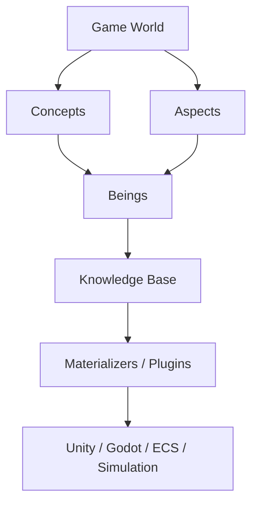
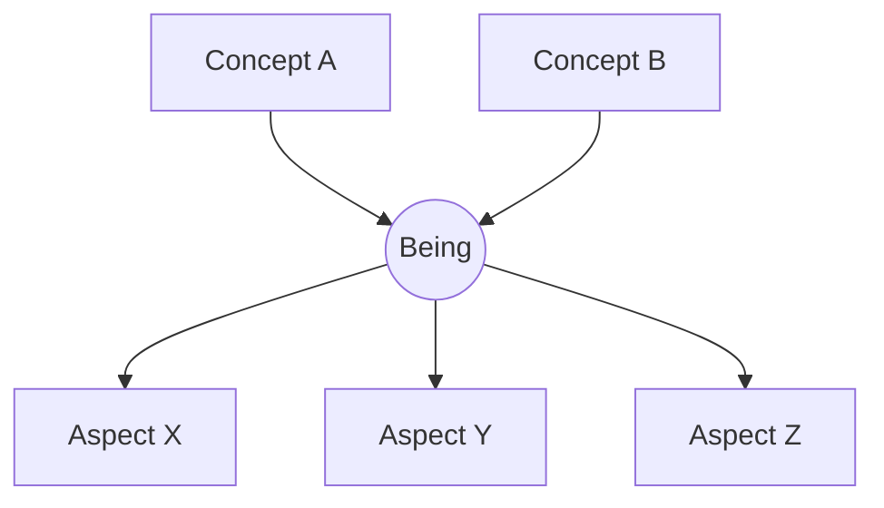
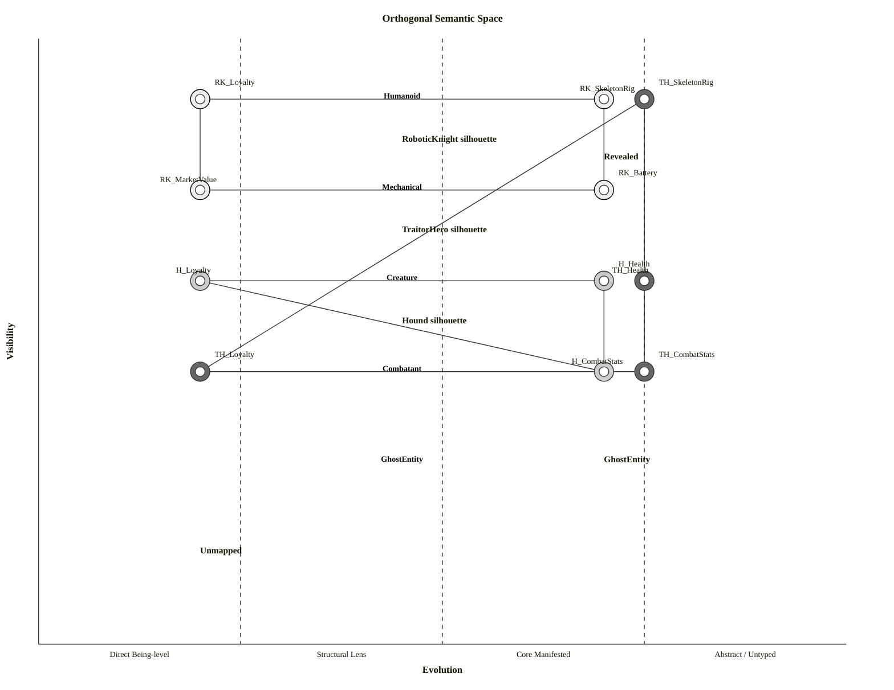
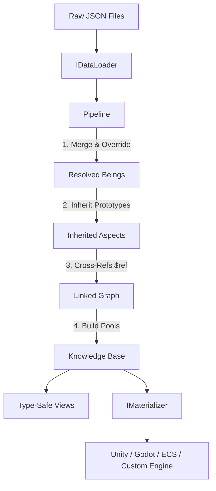
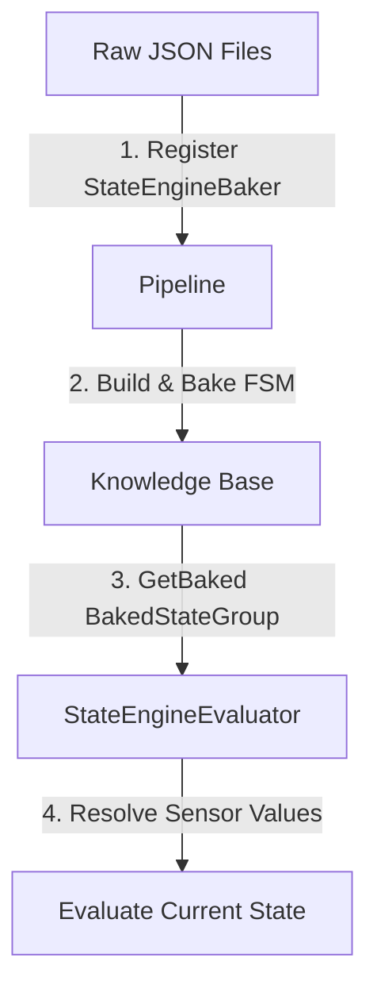

# DataCatalyst

[](https://www.nuget.org/packages/DataCatalyst/)
[](https://github.com/fm39hz/DataCatalyst/actions)
[](LICENSE)

Game modeling framework for C#/.NET.

---

> **Code itself has no game specific content.** Game logic, behaviors, values, etc... should never be hardcoded. Designers parameterize everything to model the world.

---

## Overview



---

## 🧬 Core Idea

Everything in DataCatalyst is built from three primitives: **Aspect**, **Being**, and **Concept** (the ABC model).

### The ABC Model



- **Concept**: A **perspective** (viewpoint) through which a being can be observed (e.g., `Humanoid`, `Mechanical`, `Creature`). Concepts are strictly orthogonal and are NOT categories or rigid class taxonomies.
- **Aspect**: A **lens** for observing a specific facet or raw data structure of a being (e.g., `SkeletonRig`, `BatteryCapacity`, `Loyalty`).
- **Being**: A **thing that exists** in the game world (e.g., `RoboticKnight`, `Hound`). A being IS, independent of how it's categorized, observed, or filtered by systems.

### Orthogonality

Concepts are not hierarchical; they are clean, independent axes. Deeper abstraction yields cleaner atomic aspects. In this frame, every naming for each of 1 primitives will require a lot of thinking, ideally is 1 ~ 2 words.

For example, consider two completely different beings: `RoboticKnight` and `Hound`.

- `RoboticKnight` maps to 2 Concepts: `Humanoid` (revealing its `SkeletonRig` for human animations) and `Mechanical` (revealing `BatteryCapacity`). It also possesses `Loyalty` as a free-floating, being-level aspect (loyalty to the king does not need a "Knight" concept wrapper).
- `Hound` (The counter-example) maps to `Creature` (revealing `BiomedicalStats`) but also possesses `Loyalty` directly.

A drone is `Mechanical` but not `Humanoid`. A zombie is `Humanoid` but not `Mechanical`. A machine and a dog can both share `Loyalty` without sharing any common bloodline or base class. Connecting these coordinate points on the XY axes reveals the true closed semantic silhouette of a being:



### Mathematical Model

Mathematically, the game design database is a space defined by two orthogonal axes:

- **Concept Axis ($C$)**: The space of Concepts. A Being $B$ must map to at least one Concept ($|Concepts(B)| \ge 1$).
- **Aspect Axis ($A$)**: The space of Aspects. Aspects are free-floating and can belong to a Being directly or connect via a Concept projection.

A Being $B_i$ is a coordinate point in the Cartesian product of the Concept power set and Aspect power set:

```math
B_i = (C_{B_i}, A_{B_i}) \quad \text{where} \quad C_{B_i} \subseteq C, \ A_{B_i} \subseteq A

```

> ABC is a self-balancing system on orthogonal axes, so A ~ B ~ C, which is roughly equal in general, if some is much higher than the others, then the abstraction that you assumed is _may be_ not correct, just maybe. _B_ could be a little bit higher than the others, but not too much, and thats fine only if your game is too specialized in some way.

---

## 🚀 Quick Start

### 1. Install

```bash
dotnet add package DataCatalyst

```

### 2. Write Data

`Data/beings.json`:

```json
{
	"RoboticKnight": {
		"$description": "Mechanical knight - a loyal hybrid of man and machine.",
		"$Humanoid": {
			"SkeletonRig": { "BoneCount": 24, "IsBipedal": true }
		},
		"$Mechanical": {
			"BatteryCapacity": { "MaxJoules": 5000, "Efficiency": 0.95 }
		},
		"Loyalty": { "Value": 100 }
	}
}
```

> The loader detects this is a being file by scanning for `$ConceptName` keys inside each object.

### 3. Declare Concepts & Aspects

This is manually generated by source generator, but it is okay to declared something that you don't need it to be auto-gen

```csharp
[GameConcept]
public record struct Humanoid : IConcept;

[GameConcept]
public record struct Mechanical : IConcept;

[GameAspect]
public record struct SkeletonRig { public int BoneCount; public bool IsBipedal; }

[GameAspect]
public record struct BatteryCapacity { public int MaxJoules; public double Efficiency; }

[GameAspect]
public record struct Loyalty { public int Value; }

```

### 4. Load, Build & Acess

```csharp
// Create registries, populate from generated code
var registries = new RegistrySet();
DataCatalystRegistries.Populate(registries);

// Fluent API - mix & match your sources
var knowledge = new Pipeline(registries)
    .AddSource("Base", new JsonDataLoader(registries.Beings), "Data/")
    .AddSource("DLC", new JsonDataLoader(registries.Beings), "DownloadableContent/")    // the loader will auto discover nested sub sections
    .AddSource("Mod", new JsonDataLoader(registries.Beings), "Mods/")
    .AddBaker(new StateEngineBaker(registries.Beings))
    .Run(out var diagnostics);

// Access - type-safe, compile-time checked via IRevealedBy<TConcept>
int bones = knowledge.Of<Humanoid, SkeletonRig>(typeof(RoboticKnight)).BoneCount;
int power = knowledge.Of<Mechanical, BatteryCapacity>(typeof(RoboticKnight)).MaxJoules;
```

`RoboticKnight` is a generated `being` marker type implementing `IViewableAs<Humanoid>`, `IViewableAs<Mechanical>`.

---

## 🏗️ Architecture

DataCatalyst processes your design GDD database through a statically resolved compilation pipeline, converting raw files into highly optimized flat memory layouts.



---

## 🧩 Usage

The framework workflow is divided into four main phases: **Model**, **Compose**, **Access**, and **Integrate**.

---

### 1. Model

Define your concepts, aspects, and beings to map out the structure of your game.

#### Concepts

In `concepts.json`, Each concept declares which aspects it reveals:

```json
{
	"concepts": {
		"Humanoid": {
			"$description": "Human-shaped, bipedal form.",
			"$reveals": ["SkeletonRig"]
		},
		"Mechanical": {
			"$description": "Machinery-based construction.",
			"$reveals": ["BatteryCapacity"]
		},
		"Creature": {
			"$description": "Natural organism.",
			"$suggests": ["BiomedicalStats"]
		}
	}
}
```

> `$reveals` = aspects guaranteed through this perspective.
> `$suggests` = aspects that may also be visible (designer guidance).

#### Aspects

In `aspects.json` define the fields each lens carries:

```json
{
	"aspects": {
		"SkeletonRig": {
			"fields": { "BoneCount": "int", "IsBipedal": "bool" }
		},
		"BatteryCapacity": {
			"fields": { "MaxJoules": "int", "Efficiency": "float" }
		},
		"Loyalty": {
			"fields": { "Value": "int" }
		}
	}
}
```

---

### 2. Compose

Leverage prototype inheritance and cross-references to assemble complex data profiles with minimal repetition.

#### Prototype Inheritance (`$inherits` / `inherits`)

Beings can inherit aspect values from another being. Unspecified fields in the child being fall back to the parent being's values. This is data normalization, not class inheritance - a child being can introduce concepts and aspects that the parent does not have.

`Data/beings.json`:

```json
{
	"BaseAutomaton": {
		"$description": "Base automaton - shared defaults for all robots.",
		"$Mechanical": {
			"BatteryCapacity": { "MaxJoules": 2000, "Efficiency": 0.8 }
		}
	},
	"RoboticKnight": {
		"$inherits": "BaseAutomaton",
		"$Mechanical": {
			"BatteryCapacity": { "MaxJoules": 5000 }
		}
	}
}
```

_Result: `RoboticKnight` overrides `BatteryCapacity.MaxJoules` to `5000`, inheriting `BatteryCapacity.Efficiency` as `0.80`._

#### Cross-Reference (`$ref`)

You can reference other beings using the `"$ref"` key. The pipeline resolves these references at build time, replacing the reference object with the target being's key string.

`Data/beings.json`:

```json
{
	"RoboticKnight": {
		"$description": "Mechanical knight powered by a plutonium core.",
		"$Mechanical": {
			"PowerCore": { "CoreId": { "$ref": "PlutoniumCell" } }
		}
	}
}
```

_At runtime, `PowerCore` will be resolved to `"PlutoniumCell"`._

---

### 3. Access

Query and traverse the compiled database using highly optimized, type-safe APIs.

#### Knowledge & Views

The final result of the pipeline is a `Knowledge` instance containing fast, flat-array storage pools.

```csharp
// Direct lookup - compile-time checked
int maxJoules = knowledge.Of<Mechanical, BatteryCapacity>(typeof(RoboticKnight)).MaxJoules;

// Being-level aspect (no concept)
int loyalty = knowledge.About<Loyalty>(typeof(RoboticKnight)).Value;

// Constraint IRevealedBy<TConcept>
knowledge.Of<Mechanical, SkeletonRig>(typeof(RoboticKnight)); // compile error
```

---

### 4. Integrate

Bridge the engine-agnostic database to your specific game loader and engine objects.

#### Loader

Implement `IDataLoader` to support formats like CSV, YAML, MsgPack, etc.

```csharp
public class CsvDataLoader : IDataLoader {
    public LoadResult Load(string content, string fallbackKey) {
        var result = new LoadResult();
        // Parse CSV string content -> RawBeing
        return result;
    }
    public LoadResult LoadFile(string path) => Load(File.ReadAllText(path), Path.GetFileNameWithoutExtension(path));
    public LoadResult LoadDirectory(string path) {
        var result = new LoadResult();
        foreach (var file in Directory.EnumerateFiles(path, "*.csv")) {
            result._beings.AddRange(LoadFile(file)._beings);
        }
        return result;
    }
}

```

#### Materializer

Bridge DataCatalyst's `Knowledge` to engine-specific game objects or entities. Define a pattern once, and SourceGen dispatches all aspects automatically.

```csharp
[Materializer]
partial class EcsMaterializer : IMaterializer<Entity> {
    readonly Knowledge _k;
    void Apply<T>(Entity e, T c) where T : struct => _k.Add(e, c);
}

// Usage in Game Loop (Unity, Godot, ECS, etc.)
var mat = new EcsMaterializer(knowledge);
mat.Apply(entity, knowledge.Of<Mechanical, BatteryCapacity>(typeof(RoboticKnight)));

```

---

## 🔌 Bundled Plugin

### StateEngine

StateEngine is a data-driven hierarchical FSM. FSM components (States, Sensors, and Transitions) are completely normalized into core ABC primitives, allowing you to modify complex behaviors and condition graphs purely via data declarations. Baking is integrated directly into the Core Pipeline, executing FSM compilation during database build.



#### Write State Data

Define states, sensors, and state groups as standard `Being` entities in `Data/beings.json`:

```json
{
	"RechargeStationDistance": {
		"$Sensor": {}
	},
	"GoToRecharge": {
		"$State": {}
	},
	"GuardPatrol": {
		"$State": {},
		"StateTransitions": {
			"Transitions": [
				{
					"TargetState": { "$ref": "GoToRecharge" },
					"Priority": 100,
					"Conditions": {
						"All": [
							{
								"Sensor": { "$ref": "RechargeStationDistance" },
								"Op": "<",
								"Value": 15.0
							}
						]
					}
				}
			]
		}
	},
	"KnightAI": {
		"$State": {
			"StateGroup": {
				"DefaultState": { "$ref": "GuardPatrol" },
				"States": [
					{ "$ref": "GuardPatrol" },
					{ "$ref": "GoToRecharge" }
				],
				"PriorityTier": 0,
				"TierScale": 10000,
				"DepthPenalty": 1000
			}
		}
	}
}
```

#### Bake & Evaluate FSM

Register the baker in the pipeline and fetch the compiled graph directly from the knowledge base at runtime:

```csharp
// 1. Build — State, Sensor are concepts; StateGroup, StateTransitions are aspects
var registries = new RegistrySet();
DataCatalystRegistries.Populate(registries);

var knowledge = new Pipeline(registries)
    .AddSource("Base", new JsonDataLoader(registries.Beings), "Data/")
    .AddBaker(new StateEngineBaker(registries.Beings))
    .Run(out var diagnostics);

// 2. Retrieve - Get the pre-compiled FSM directly from Knowledge using Being type
var baked = knowledge.GetBaked<BakedStateGroup, KnightAI>();

// 3. Evaluate - ONE evaluator engine for ALL entities
var evaluator = new StateEngineEvaluator();
var result = evaluator.Evaluate(
    currentState, baked, viableStates,
    sensor => {
        if (sensor == typeof(RechargeStationDistance)) {
            return entity.DistanceToStation;
        }
        return 0f;
    }
);
```

---

## 📦 Packages

DataCatalyst is modular, letting you install only the components your project needs.

```bash
dotnet add package DataCatalyst
dotnet add package DataCatalyst.Plugins.StateEngine             # FSM plugin (optional)

```

---

## 🛠️ DataCatalyst Editor (WIP)

The editor is a visual workspace for authoring and inspecting the semantic structure of a game database.

Instead of treating game design as forms, tables, or object inspectors, it presents the underlying knowledge model as an interactive semantic space. Concepts, Aspects, and Beings are projected into a consistent visual representation, allowing designers to reason about relationships, structure, and composition rather than individual files.

The editor is intended to support structural authoring and exploration of game knowledge. It does **not** replace engine tooling such as scene editors, animation tools, or runtime debuggers. Runtime behavior remains the responsibility of the target engine; the editor focuses exclusively on the design-time organization and compilation of knowledge.

> The editor is under heavy development, and will not be ready anytime soon.

### Milestones

- Visual editing of the ABC semantic model.
- Structural visualization of ontology and knowledge topology.
- Multiple synchronized projections of the same knowledge graph for different authoring tasks.
- Architecture-oriented diagnostics to expose structural imbalance, coupling, and normalization opportunities.
- Extensible visualization layers for domain-specific plugins such as StateEngine.

The editor is designed as a deterministic view over the knowledge graph. Visualizations may provide semantic grouping or navigation assistance, but they never become the source of truth or modify the underlying model implicitly.

---

## ⚖️ License

Distributed under the MIT License. See [LICENSE](https://www.google.com/search?q=LICENSE)
