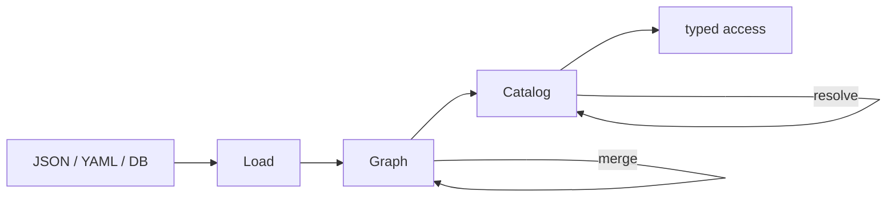
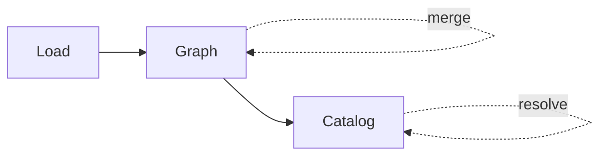
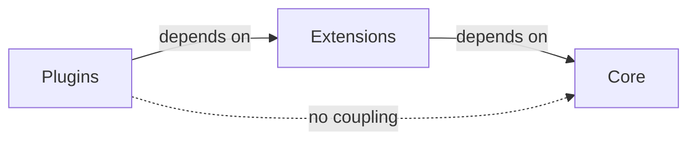
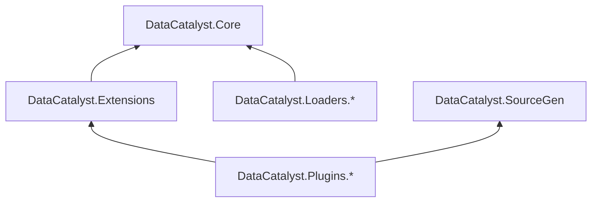

# DataCatalyst

[](https://www.nuget.org/packages/DataCatalyst/)
[](https://github.com/fm39hz/DataCatalyst/actions)
[](LICENSE)

**DataCatalyst** is a compile-time composition framework for C#/.NET. It enforces strict separation of concerns in data-driven game architecture: code is infrastructure, data is content, and SourceGen bridges them at compile time with zero reflection.

---

## 💡 What & Why

> **Code itself has no content.** Game logic, behaviors, values should never be hardcoded.
> Designers parameterize everything to model the world — not play with tables.

DataCatalyst is not a serializer, not a tuning library. It is a **pure infrastructure layer** — mechanics-agnostic, format-agnostic, ECS-agnostic. The pipeline:



---

## 🚀 Quick Start

### 1. Install

```bash
# Source Generator (auto-registers [DataComponent] / [DataPlugin])
dotnet add package DataCatalyst

# Runtime engine + JSON loader
dotnet add package DataCatalyst.Loaders.Json
```

SourceGen packages must be referenced as analyzers (the `DataCatalyst` package does this automatically).

### 2. Define Components

```csharp
using DataCatalyst.Abstractions;

[DataComponent]
public struct Health { public float Current; public float Max; }

[DataComponent]
public struct CombatStats { public float AttackPower; public float Defense; }
```

SourceGen auto-registers them — zero manual `PrimitiveRegistry` code.

### 3. Compose in JSON

`Data/BaseMonster.json`:

```json
{
	"Health": { "Current": 100, "Max": 100 },
	"CombatStats": { "AttackPower": 10, "Defense": 5 }
}
```

`Data/Goblin.json`:

```json
{
	"inherits": ["BaseMonster"],
	"Health": { "Current": 50, "Max": 50 }
}
```

### 4. Load, Resolve, Access

```csharp
using System.Text.Json;
using DataCatalyst.Core;
using DataCatalyst.Loaders;

var options = new JsonSerializerOptions { TypeInfoResolver = new DefaultJsonTypeInfoResolver() };

var result   = JsonDataLoader.LoadDirectory("Data", options);
var graph    = DataGraphBuilder.Build(result.Entries);
var catalog  = DataCatalogBuilder.Resolve(graph);

var goblinHealth = catalog.Get<Health>("Goblin");       // 50/50
var goblinStats  = catalog.Get<CombatStats>("Goblin");   // 10/5
```

---

## 🧱 Concepts

### Core

The pipeline engine. Three stages, no domain knowledge:



Three hook interfaces at each stage:

| Hook              | Stage         | Input                      | Use case                        |
| ----------------- | ------------- | -------------------------- | ------------------------------- |
| `IPostLoadPlugin` | After load    | `IReadOnlyList<DataEntry>` | Filter, augment raw entries     |
| `IGraphPlugin`    | After build   | `DataGraph`                | Cross-file validation           |
| `ICatalogPlugin`  | After resolve | `DataCatalog`              | Post-process, domain validation |

### Extensions

Domain concepts shared across plugins — no pipeline hooks, no `[DataPlugin]`. Pure infrastructure types that plugins depend on.

| Namespace                                 | Types                                                                            |
| ----------------------------------------- | -------------------------------------------------------------------------------- |
| `DataCatalyst.Extensions.Compare`         | `CompareOp`, `OperatorParser`                                                    |
| `DataCatalyst.Extensions.Composition`     | `TransitionDef`, `ConditionGroupDef`, `SensorConditionDef`, `SensorInfluenceDef` |
| `DataCatalyst.Extensions.Materialization` | `DataMaterializer<T>`, `IComponentMaterializer<T>`                               |



### Plugins

Implement pipeline hooks. Auto-discovered by SourceGen via `[DataPlugin]`.

| Plugin            | Hook             | What it does                            | SourceGen                                  |
| ----------------- | ---------------- | --------------------------------------- | ------------------------------------------ |
| **StateEngine**   | `ICatalogPlugin` | FSM validation + bake/evaluate pipeline | `[DataStateEnum]` → auto-generates mappers |
| **ConceptDomain** | `ICatalogPlugin` | Concept-scoped `GetConcept<T>()`        | `[DataConcept]` → auto-registers tags      |

### Loaders

Format-specific entry points. Produce `LoadResult`. Default: JSON. Custom loaders implement `IFormatReader<T>`.

### SourceGen

Compile-time scanners emitting `[ModuleInitializer]` code. Zero runtime reflection.

| Generator                                      | Scans                                 | Generates                                    |
| ---------------------------------------------- | ------------------------------------- | -------------------------------------------- |
| `DataCatalyst`                                 | `[DataComponent]` structs             | `PrimitiveRegistry` registrations            |
| `DataCatalyst`                                 | `[DataPlugin]` classes                | `PluginRegistry` (topo-sorted)               |
| `DataCatalyst.Plugins.StateEngine.SourceGen`   | `[DataStateEnum]`, `[DataSensorEnum]` | `IStateMapper<T>` / `ISensorMapper<T>` impls |
| `DataCatalyst.Plugins.ConceptDomain.SourceGen` | `[DataConcept("name")]`               | `ConceptRegistry` registrations              |

---

## 📦 All Packages

```bash
dotnet add package DataCatalyst                           # SourceGen (auto-analyzer)
dotnet add package DataCatalyst.Loaders.Json               # JSON loader
dotnet add package DataCatalyst.Extensions                 # Compare, Composition, Materialization

dotnet add package DataCatalyst.Plugins.StateEngine         # FSM plugin
dotnet add package DataCatalyst.Plugins.StateEngine.SourceGen  # FSM SourceGen (analyzer)

dotnet add package DataCatalyst.Plugins.ConceptDomain          # Concept plugin
dotnet add package DataCatalyst.Plugins.ConceptDomain.SourceGen # Concept SourceGen (analyzer)
```

SourceGen packages must be referenced as analyzers:

```xml
<PackageReference Include="..." OutputItemType="Analyzer" ReferenceOutputAssembly="false" />
```

---

## 🔌 Plugin: StateEngine

Hierarchical, priority-based FSM evaluator — completely data-driven.

```csharp
using DataCatalyst.Plugins.StateEngine.Contracts;

// SourceGen auto-generates IStateMapper + ISensorMapper from these:
[DataStateEnum]
public enum GameState { Idle, Run, Jump, Patrol, Attack }

[DataSensorEnum]
public enum GameSensor { Speed, IsGrounded, Health, Alert }

using DataCatalyst.Plugins.StateEngine.Core;

// Bake at startup (mappers resolved from MapperRegistry.Default)
var baked = StateEngineBaker.Bake<GameState, GameSensor>(
    catalog.Get<StateGroup>("Locomotion"));

// Evaluate per frame — zero allocation
var result = StateEngineEvaluator<GameState, GameSensor>.Evaluate(
    currentStateId: GameState.Idle,
    group: baked,
    viableStates: activeStates,
    readSensor: sensor => entity.GetSensorValue(sensor));

if (result.HasValue) entity.TransitionTo(result.TargetStateId);
```

### Features

- **Hierarchical states** — parent fallback with configurable depth penalty
- **Hysteresis** — separate `Value` / `ExitValue` thresholds prevent flickering
- **Dynamic priorities** — sensor influences modify base priority at runtime
- **Zero alloc evaluation** — pre-baked transition tables, no string comparisons

---

## 🔌 Plugin: ConceptDomain

Type-safe scoped access to entry groups without magic strings.

```csharp
using DataCatalyst.Plugins.ConceptDomain;

[DataConcept("Item")]
public readonly record struct ItemTag;

[DataConcept("Enemy")]
public readonly record struct EnemyTag;

// Data-driven entry mapping:
plugin.LoadConcepts("concepts.json");
// { "Item": ["Sword", "Shield"], "Enemy": ["Goblin"] }

// Or manual:
plugin.RegisterEntries("Item", "Sword", "Shield");

var items   = catalog.GetConcept<ItemTag>();
var enemies = catalog.GetConcept<EnemyTag>();

var swordHealth  = items.Get<Health>("Sword");
var goblinHealth = enemies.Get<Health>("Goblin");
```

---

## ⚡ Native AOT & Trim Safety

- **Zero runtime reflection** — SourceGen registers types via `[ModuleInitializer]`
- **Compile-time discriminator mapping** — JSON keys resolved against source-generated dictionary
- **Collision handling** — DC002 warning + fully-qualified namespace fallback
- **Trim-safe serialization** — `JsonDataLoader` accepts `JsonSerializerOptions` for source-generated contexts

---

## 🏗️ Project Layout

```
DataCatalyst.Abstractions/                 Zero-dep contracts
DataCatalyst.Core/                         Pipeline engine
DataCatalyst.Extensions/                   Domain concepts
  └─ Compare/ Composition/ Materialization/
DataCatalyst.Loaders.Json/                 AOT-safe JSON loader
DataCatalyst.SourceGen/                    Core generators

DataCatalyst.Plugins.StateEngine/          FSM plugin
DataCatalyst.Plugins.StateEngine.SourceGen/
DataCatalyst.Plugins.ConceptDomain/        Concept plugin
DataCatalyst.Plugins.ConceptDomain.SourceGen/
```

### Dependency Graph



---

## ⚖️ License

Distributed under the MIT License. See [LICENSE](LICENSE).
