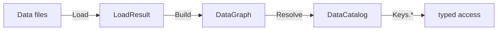
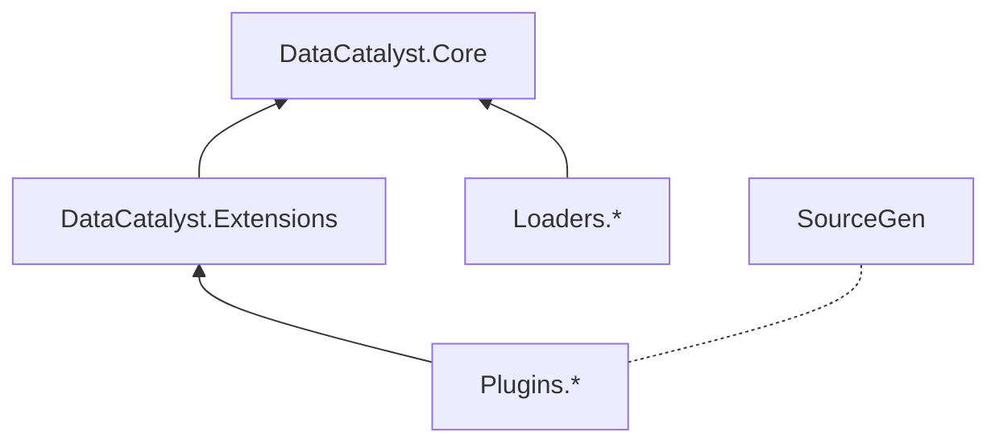
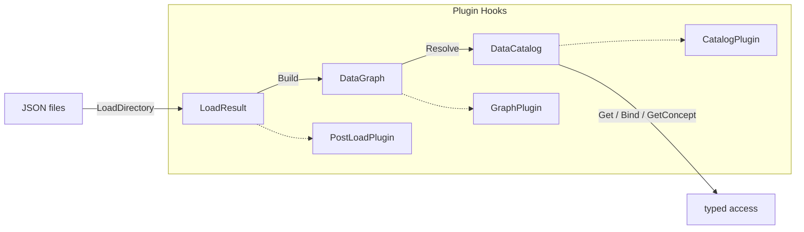

# DataCatalyst

[](https://www.nuget.org/packages/DataCatalyst/)
[](https://github.com/fm39hz/DataCatalyst/actions)
[](LICENSE)

**DataCatalyst** is a compile-time composition framework for C#/.NET. It enforces strict separation of concerns in data-driven game architecture: code is infrastructure, data is content, and SourceGen bridges them at compile time.



---

## 💡 Philosophy

> **Code itself has no content.** Game logic, behaviors, values should never be hardcoded.
> Designers parameterize everything to model the world.

DataCatalyst is not a serializer, not a data-tuning library. It is a **pure infrastructure layer** that is completely mechanics-agnostic.

---

## 🚀 Quick Start

### 1. Install

```bash
dotnet add package DataCatalyst
dotnet add package DataCatalyst.Loaders.Json
```

### 2. Define Components

```csharp
using DataCatalyst.Abstractions;

[DataComponent]
public struct Health { public float Current; public float Max; }

[DataComponent]
public struct CombatStats { public float AttackPower; public float Defense; }
```

SourceGen auto-registers them — no manual `PrimitiveRegistry` code.

### 3. Compose in JSON

`Data/BaseMonster.json`:

```json
{
	"Health": { "Current": 100, "Max": 100 },
	"CombatStats": { "AttackPower": 10, "Defense": 5 }
}
```

`Data/Goblin.json`:

```json
{
	"inherits": ["BaseMonster"],
	"Health": { "Current": 50, "Max": 50 }
}
```

### 4. Load, Resolve, Access

```csharp
using System.Text.Json;
using DataCatalyst.Core;
using DataCatalyst.Loaders;

var options = new JsonSerializerOptions { TypeInfoResolver = new DefaultJsonTypeInfoResolver() };

var result   = JsonDataLoader.LoadDirectory("Data", options);
var graph    = DataGraphBuilder.Build(result.Entries);
var catalog  = DataCatalogBuilder.Resolve(graph);

var goblinHealth = catalog.Get<Health>(Keys.Goblin);       // 50/50
var goblinStats  = catalog.Get<CombatStats>(Keys.Goblin);   // 10/5
```

`Keys.Goblin` is a `public const string` generated by SourceGen from the file name `Goblin.json`. Entry key typos are compile-time errors.

---

## 🏗️ Project Architecture

DataCatalyst is divided into small, focused modules:

```
DataCatalyst.Abstractions/                 Contracts, attributes, interfaces
DataCatalyst.Core/                         Pipeline engine (registries, builders)
DataCatalyst.Extensions/                   Domain concepts (compare, composition, materialization)
DataCatalyst.Loaders.Json/                 JSON file loader
DataCatalyst.SourceGen/                    Compile-time generators

DataCatalyst.Plugins.StateEngine/          Data-driven hierarchical FSM
DataCatalyst.Plugins.StateEngine.SourceGen/
DataCatalyst.Plugins.GameConcept/                Game concept scoped entry access
DataCatalyst.Plugins.GameConcept.SourceGen/
```



### Data Flow Pipeline



---

## 🧩 Core

### Pipeline Types

| Type                    | Description                                                                        |
| ----------------------- | ---------------------------------------------------------------------------------- |
| `DataEntry`             | One entry — `Key`, `Inherits`, `Components` (typed structs), `SourceFile`, `Layer` |
| `DataGraph`             | Unresolved dependency graph — `Dictionary<string, DataEntry>`                      |
| `DataCatalog`           | Resolved immutable catalog — `Get<T>(key)`, `TryGet<T>(key)`, `ContainsKey(key)`   |
| `DataCatalogExtensions` | `Bind<TKey, TComponent>(selector)` — extract one component type into a dictionary  |
| `DataGraphBuilder`      | Static `Build(entries, diagnostics?, env?)` — layer-aware merge                    |
| `DataCatalogBuilder`    | Static `Resolve(graph, diagnostics?, env?)` — inheritance flattening               |

### Registries

| Registry                  | Auto-populated by SourceGen     |
| ------------------------- | ------------------------------- |
| `PluginRegistry`          | `IPlugin` classes               |
| `PrimitiveRegistry`       | `[DataComponent]` structs       |
| `MapperRegistry`          | `[StateEnum]`, `[SensorEnum]`   |
| `ConceptRegistry`         | `[DataConcept("name")]` structs |
| `ServiceRegistry`         | Manual                          |
| `DataViewAdapterRegistry` | Manual                          |

### Plugin Hooks

| Hook              | Called                | Input                      |
| ----------------- | --------------------- | -------------------------- |
| `IPostLoadPlugin` | After `LoadDirectory` | `IReadOnlyList<DataEntry>` |
| `IGraphPlugin`    | After `Build`         | `DataGraph`                |
| `ICatalogPlugin`  | After `Resolve`       | `DataCatalog`              |

---

## 🧩 Extensions

Domain concepts shared across plugins. No pipeline hooks.

### Compare

```csharp
using DataCatalyst.Extensions.Compare;

var op   = OperatorParser.Parse(">=");   // CompareOp.GreaterThanOrEqual
var pass = OperatorParser.Evaluate(5f, op, 3f); // true
```

### Composition

Input schema for the StateEngine plugin. All types are `[DataComponent]`:

- `TransitionDef` — target state, priority, conditions, influences
- `ConditionGroupDef` — All (AND), Any (OR), None (NOT) gates
- `SensorConditionDef` — signal, operator, thresholds
- `SensorInfluenceDef` — signal, weight

### Materialization

Bridge between `DataEntry` and game objects:

```csharp
using DataCatalyst.Extensions.Materialization;

var materializer = new DataMaterializer<Entity>();
materializer.Register<Health>((e, h) => e.SetHealth(h.Current, h.Max));
materializer.Register<CombatStats>((e, s) => e.SetCombat(s.AttackPower, s.Defense));

foreach (var (key, entry) in catalog.Entries)
{
    var entity = new Entity();
    materializer.Materialize(entry, entity);
}
```

---

## 🔌 Plugins

### StateEngine

Hierarchical, priority-based FSM — completely data-driven.

```csharp
using DataCatalyst.Plugins.StateEngine.Contracts;

[StateEnum]
public enum AIState { Idle, Patrol, Attack, Flee }

[SensorEnum]
public enum AISensor { PlayerDistance, HealthPercent, Alert }
```

SourceGen auto-generates `IStateMapper<AIState>` + `ISensorMapper<AISensor>`.

```json
{
	"GroupId": "Locomotion",
	"DefaultState": "Idle",
	"States": {
		"Idle": {
			"Transitions": [
				{
					"TargetState": "Patrol",
					"Priority": 5,
					"Conditions": {
						"All": [
							{
								"Signal": "PlayerDistance",
								"Op": "<",
								"Value": 10
							}
						]
					}
				}
			]
		}
	}
}
```

```csharp
using DataCatalyst.Plugins.StateEngine.Core;

// Bake at startup — mappers resolved from MapperRegistry.Default
var baked = StateEngineBaker.Bake<AIState, AISensor>(
    catalog.Get<StateGroup>(Keys.Locomotion));

// Evaluate per frame
var result = StateEngineEvaluator<AIState, AISensor>.Evaluate(
    currentStateId: AIState.Idle,
    group: baked,
    viableStates: new HashSet<AIState> { AIState.Patrol, AIState.Attack },
    readSensor: sensor => sensor switch {
        AISensor.PlayerDistance => entity.DistanceToPlayer,
        AISensor.HealthPercent  => entity.Health / entity.MaxHealth,
        _ => 0f
    });

if (result.HasValue) entity.TransitionTo(result.TargetStateId);
```

Features: hierarchical states with parent fallback, hysteresis (`Value` / `ExitValue`), dynamic sensor influences.

### GameConcept

Game designers think in domains: "my game has **weapons**, **currency**, **skills**, **combat**." GameConcept lets you declare these as typed, data-driven groupings — not as ECS entity IDs, not as tag components, not as Godot groups.

```csharp
using DataCatalyst.Plugins.GameConcept;

[DataConcept("Weapon")]  public readonly record struct WeaponConcept;
[DataConcept("Currency")] public readonly record struct CurrencyConcept;
```

Map entries at runtime:

```csharp
var plugin = new GameConceptPlugin();
plugin.RegisterEntries<WeaponConcept>(Keys.IronSword, Keys.BattleAxe);
plugin.RegisterEntries<CurrencyConcept>(Keys.Gold, Keys.Silver);
plugin.RegisterEntries<SkillConcept>(Keys.Fireball, Keys.Heal);
plugin.OnCatalogResolved(catalog, diagnostics);
```

Or load from JSON:

```json
{ "Weapon": ["IronSword", "BattleAxe"], "Currency": ["Gold", "Silver"] }
```

```csharp
plugin.LoadConcepts("Data/concepts.json");
```

Access:

```csharp
var weapons   = catalog.GetConcept<WeaponConcept>();
var currencies = catalog.GetConcept<CurrencyConcept>();

var swordAtk = weapons.Get<CombatStats>(Keys.IronSword);
var goldVal  = currencies.Get<Value>(Keys.Gold);
```

---

## 📦 Packages

```bash
# Core
dotnet add package DataCatalyst                              # SourceGen
dotnet add package DataCatalyst.Loaders.Json                  # JSON loader
dotnet add package DataCatalyst.Extensions                    # Compare, Composition, Materialization

# Plugins
dotnet add package DataCatalyst.Plugins.StateEngine
dotnet add package DataCatalyst.Plugins.StateEngine.SourceGen
dotnet add package DataCatalyst.Plugins.GameConcept
dotnet add package DataCatalyst.Plugins.GameConcept.SourceGen
```

SourceGen packages must be referenced as analyzers:

```xml
<PackageReference Include="DataCatalyst.Plugins.StateEngine.SourceGen"
    OutputItemType="Analyzer" ReferenceOutputAssembly="false" />
```

---

## ⚡ SourceGen

All generators run at compile time and produce code that is linked into the consuming project. They eliminate manual boilerplate.

| Generator               | Scans                         | Produces                                   |
| ----------------------- | ----------------------------- | ------------------------------------------ |
| `ComponentGenerator`    | `[DataComponent]` structs     | Type registrations in `PrimitiveRegistry`  |
| `PluginGenerator`       | `IPlugin` classes             | Plugin registrations in `PluginRegistry`   |
| `EntryKeysGenerator`    | Data file names               | `Keys.{FileName}` constants                |
| `StateMachineGenerator` | `[StateEnum]`, `[SensorEnum]` | `IStateMapper<T>` + `ISensorMapper<T>`     |
| `ConceptGenerator`      | `[DataConcept("name")]`       | Concept registrations in `ConceptRegistry` |

---

## ⚖️ License

Distributed under the MIT License. See [LICENSE](LICENSE).
