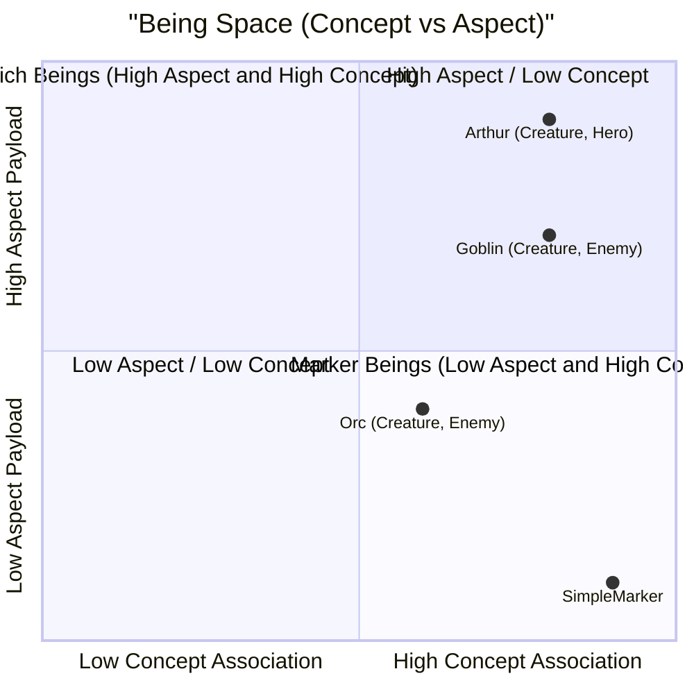
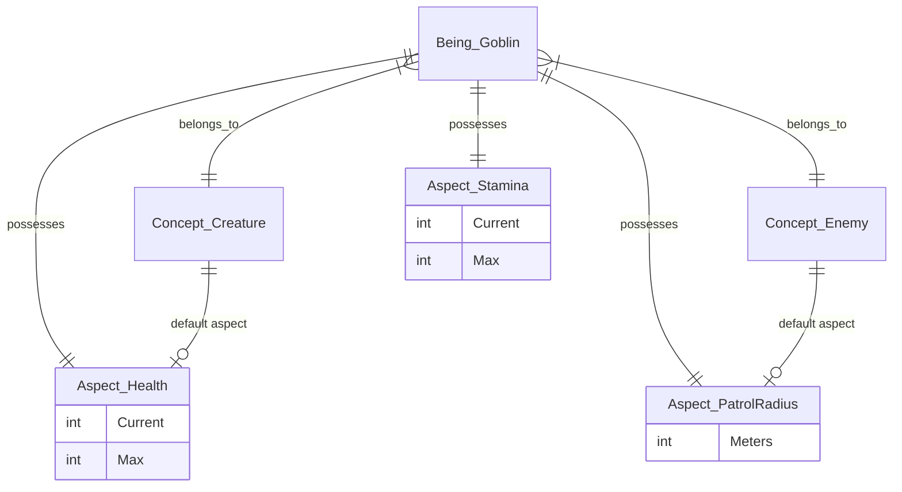

# DataCatalyst

[](https://www.nuget.org/packages/DataCatalyst/)
[](https://github.com/fm39hz/DataCatalyst/actions)
[](LICENSE)

**DataCatalyst** is an Game modeling framework for C#/.NET

---

> **Code itself has no content.** Game logic, behaviors, values, etc... should never be hardcoded. Designers parameterize everything to model the world.

---

## 🚀 Quick Start

```bash
dotnet add package DataCatalyst
dotnet add package DataCatalyst.Loaders.Json
```

### 1. Write Data

`Data/Creatures.json`:

```json
{
	"Hero": {
		"$Creature": {
			"Health": { "Initial": 50, "Max": 50 },
			"CombatStats": { "BaseDamage": 8, "BaseDefense": 5 }
		},
		"$Player": {},
		"$Protagonist": {}
	}
}
```

### 2. With Concept & Aspect

```csharp
[GameConcept]
public record struct Creature : IConcept;

[GameConcept]
public record struct Player : IConcept;

[GameConcept]
public record struct Protagonist : IConcept;

[GameAspect]
public record struct Health { public int Initial; public int Max; }

[GameAspect]
public record struct CombatStats { public int BaseDamage; public int BaseDefense; }
```

### 3. Load, Build & Access

```csharp
// Simple fluent API
Knowledge knowledge = new Pipeline()
    .AddSource("Base", new JsonDataLoader(), "Data/")
    .AddSource("Mods", new JsonDataLoader(), "Mods/")
    .Build(out var diagnostics);

// Access - typed
int hp  = knowledge.Of<Creature>().At<Hero>().Take<Health>().Initial;
int atk = knowledge.Of<Player>().At<Hero>().Take<CombatStats>().BaseDamage;
```

`Hero` is a generated `being` marker type implementing `IBelongTo<Creature>`, `IBelongTo<Player>`, `IBelongTo<Protagonist>` - compile-time safe.

---

## 📦 Packages

```bash
dotnet add package DataCatalyst                               # SourceGen + Core
dotnet add package DataCatalyst.Loaders.Json                  # JSON loader
dotnet add package DataCatalyst.Extensions                    # Compare, Composition, Materialization
dotnet add package DataCatalyst.Plugins.StateEngine
dotnet add package DataCatalyst.Plugins.StateEngine.SourceGen
```

SourceGen packages as analyzers:

```xml
<PackageReference Include="..." OutputItemType="Analyzer" ReferenceOutputAssembly="false" />
```

---

## 🧬 Core Philosophy & Architecture

DataCatalyst is designed around a **multi-dimensional orthogonal structure**, avoiding the vertical limitations of Object-Oriented Programming (OOP) and the unstructured horizontal bag of components in Entity-Component Systems (ECS).

A **Being** is a point of intersection (orthogonality) between multiple **Concepts** (defining its identity) and **Aspects** (containing its data payloads).

### Geometric Representation

Mathematically, the game design database is a space defined by two orthogonal axes:

- **Concept Axis ($C$)**: The identity space. A Being $B$ must map to at least one Concept ($|Concepts(B)| \ge 1$).
- **Aspect Axis ($A$)**: The data payload space. Aspects are free-floating and can belong to a Being directly or connect to a Concept.

A Being $B_i$ is a coordinate point in the Cartesian product of the Concept power set and Aspect power set:

```math
B_i = (C_{B_i}, A_{B_i}) \quad \text{where} \quad C_{B_i} \subseteq C, \ A_{B_i} \subseteq A
```

For example, we can map Beings in this multi-dimensional space.



### Orthogonal Relationship Diagram

The following Mermaid diagram shows how `Being` sits orthogonally between the `Concept` and `Aspect` dimensions:



---

## 🧩 Usage

### Knowledge - immutable catalog

Pipeline final result

```csharp
knowledge.Of<Creature>().At<Hero>().Take<Health>().Initial;

// Concept-scoped view
var creatures = knowledge.Of<Creature>();
creatures.At<Hero>().Take<Health>().Initial;
```

### Concept

A concept, as its name implies, stands for a concept about something in your game.

```csharp
[GameConcept]
public record struct Creature : IConcept;
```

### Aspect

An aspect is a data unit attached to beings of a concept. Multiple concepts beings can share aspect types.

```csharp
[GameAspect]
public record struct Health { public int Initial; public int Max; }
```

### Inheritance & Reference

#### Aspect Inheritance

A being can inherit aspect values from another being. Unspecified fields in the child being will fall back to the parent being's values.

```json
{
	"BaseMonster": {
		"$Creature": {
			"Health": { "Initial": 100, "Max": 100 }
		}
	},
	"Goblin": {
		"$inherits": "BaseMonster",
		"$Creature": {
			"Health": { "Initial": 40 }
		}
	}
}
```

In this example, `Goblin` overrides `Health.Initial` to `40`, while `Health.Max` is inherited from `BaseMonster` as `100`.

#### Cross-Reference

You can reference other beings using the `"$ref"` key. The pipeline automatically resolves these references at build time, replacing the reference object with the target being's key string.

```json
{
	"Arthur": {
		"$Creature": {
			"Weapon": { "InitialWeapon": { "$ref": "IronSword" } }
		}
	}
}
```

At runtime, `InitialWeapon` will be resolved to `"IronSword"`.

### Loader

Implement `IDataLoader` to use any format (CSV, YAML, MsgPack, ...).

```csharp
public class CsvDataLoader : IDataLoader {
    public LoadResult Load(string content, string fallbackKey) {
        var result = new LoadResult();
        // Parse CSV string content -> RawBeing
        return result;
    }

    public LoadResult LoadFile(string path) {
        return Load(File.ReadAllText(path), Path.GetFileNameWithoutExtension(path));
    }

    public LoadResult LoadDirectory(string path) {
        var result = new LoadResult();
        foreach (var file in Directory.EnumerateFiles(path, "*.csv")) {
            var fileResult = LoadFile(file);
            // Combine fileResult beings, diagnostics, and mappings into result
        }
        return result;
    }
}
```

### Materializer

Bridge from DataCatalyst's Knowledge to engine-specific objects. Define a pattern once, SourceGen dispatches all aspects.

```csharp
[Materializer]
partial class EcsMaterializer : IMaterializer<Entity> {
    readonly Knowledge _k;
    void Apply<T>(Entity e, T c) where T : struct => _k.Add(e, c);
}

// Usage - ECS
var mat = new EcsMaterializer(knowledge);
mat.Apply(entity, knowledge.Of<Creature>().At<Hero>());

// Usage - Godot/Unity with [Materialize]
[Materialize]
partial class Player : CharacterBody2D {
    public override void _Ready() => this.Materialize();
}
```

### Extensions

| Namespace                                 | Types                                                                            |
| ----------------------------------------- | -------------------------------------------------------------------------------- |
| `DataCatalyst.Extensions.Compare`         | `CompareOp`, `OperatorParser`                                                    |
| `DataCatalyst.Extensions.Composition`     | `TransitionDef`, `ConditionGroupDef`, `SensorConditionDef`, `SensorInfluenceDef` |
| `DataCatalyst.Extensions.Materialization` | `IMaterializer<T>`, `MaterializerAttribute`, `MaterializeAttribute`              |

---

## 🔌 Bundled Plugin

### StateEngine

Data-driven hierarchical FSM. States, signals, and transitions are data - behavior is never hardcoded.

```json
{
	"goblinAI": {
		"$LocomotionStates": {
			"stateGroup": {
				"groupId": "GoblinAI",
				"defaultState": "Patrol",
				"states": {
					"patrol": {
						"transitions": [
							{
								"targetState": "Chase",
								"priority": 100,
								"conditions": {
									"all": [
										{
											"signal": "PlayerDistance",
											"op": "<",
											"value": 8
										}
									]
								}
							}
						]
					}
				}
			}
		}
	}
}
```

```csharp
// Bake - resolve string names to int IDs
var baked = StateEngineBaker.Bake(
    knowledge.Of<LocomotionStates>().At<GoblinAI>().Take<StateGroup>(),
    knowledge
);

// Evaluate - ONE engine for ALL entities
var result = StateEngineEvaluator.Evaluate(
    baked.DefaultStateId, baked, viableStates,
    signalId => signalId switch {
        PlayerDistance => entity.DistanceToPlayer,
        _ => 0f
    });
```

StateEngine is originally designed for ECS: ONE system evaluates ALL entities, but is compatible with normal use-cases.

---

## 🛠️ Editor

A node graph editor is currently under development but will not be finished anytime soon.

---

## ⚖️ License

Distributed under the MIT License. See [LICENSE](LICENSE)
