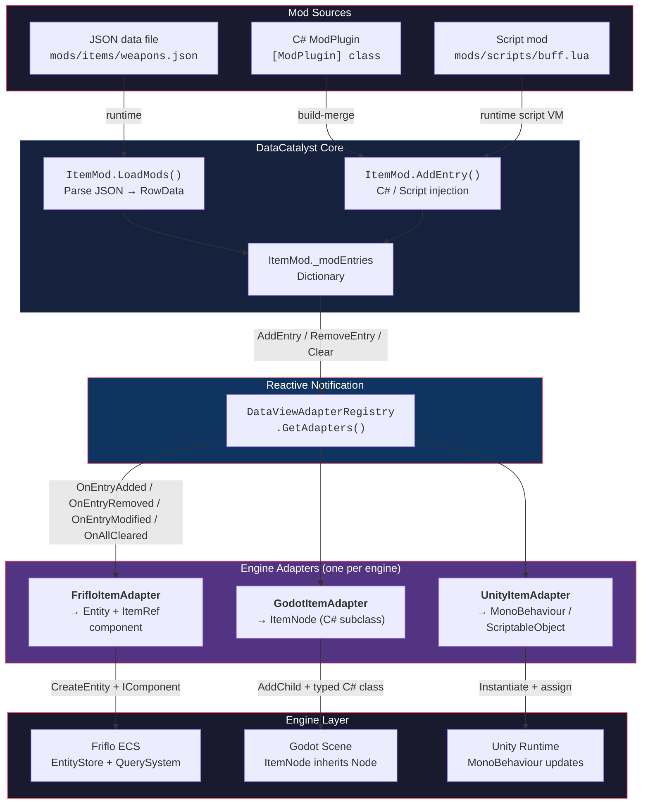

# DataCatalyst — Example Plugins

## Data flow



## Dependency resolution

### Runtime data flow

```
Mod JSON file
    → ItemMod.LoadMods("mods/items/")
        → ItemJson.Read(ref Utf8JsonReader)     ← generated, no reflection
            → ItemMod.AddEntry(key, entry)
                → _modEntries[key] = entry
                    → DataViewAdapterRegistry.GetAdapters<Item>()
                        → GodotItemAdapter.OnEntryAdded()
                            → scene.AddChild(new ItemNode { Kind = kind })
```

DataCatalyst holds the single source of truth (`FrozenDictionary<Kind, T>` + `_modEntries`).  
Adapters store only the enum key — engine reads data through `Item.Get(Kind)`.

### Build-time code mods

```
Mod source (.cs + mod.json)
    → MSBuild EnableModMerge target
        → Mods/*/Source/*.cs → <Compile>
        → Mods/*/Data/*.json → <AdditionalFiles>
            → [ModuleInitializer] registers plugin
                → PluginRegistry.LoadAll(ctx)
                    → mod calls ItemMod.AddEntry / ctx.GetService<T>()
```

### Scripting layer

```
Mod Lua script
    → Game's ScriptBridge.LoadModScripts("mods/scripts/")
        → Script calls DataBridge.Add("Item", key, entry)
            → ItemMod.AddEntry(key, entry)         ← via DataCatalyst API
        → Script calls EcsBridge.RegisterSystem()
            → Friflo SystemRoot.Add(system)        ← via game's bridge
```

### Adapter responsibility

| Adapter | Creates | Stores | Reads data from |
|---|---|---|---|
| FrifloItemAdapter | Friflo Entity + `ItemRef` | `ItemKind` enum | `Item.Get(Kind)` |
| GodotItemAdapter | `ItemNode : Node` | `ItemKind` field | `Item.Get(Kind)` |
| UnityItemAdapter | `ItemMono : MonoBehaviour` | `ItemKind` field | `Item.Get(Kind)` |

No memory duplication — adapters store only the key, actual data lives once in `FrozenDictionary`.

## Scripting Bridge

Runtime code mods through a Lua VM. No rebuild, zero GC per tick, no string catalog names.

```
Game startup
    → new ScriptBridge(store, root)
        → registers typed C# methods as Lua globals:
            Data_AddItem(key, health, weight)   → ItemMod.AddEntry
            Data_AddBuff(key, power)             → BuffMod.AddEntry
            ECS.CreateEntity()                   → store.CreateEntity()
            ECS.RegisterSystem(name, def)        → adds ScriptSystem to pipeline
    → bridge.LoadModScripts("Mods/Scripts/")
        → loads skills.lua, auras.lua
            → Lua uses typed methods (no string catalogs)
            → ScriptSystem.OnUpdate:
                foreach entity → fn.Call(entityId, dt)
                  → int + float, zero allocation
```

| Layer | Responsibility | Example file |
|---|---|---|
| Bridge | Wires typed DataCatalyst + ECS to Lua VM | [`ScriptBridge.cs`](ScriptingBridge/ScriptBridge.cs) |
| Mod script | Adds data + registers logic | [`skills.lua`](ScriptingBridge/mods/skills.lua) |

**Key design choices:**
- **No `new Table()` per entity** — `ScriptSystem.OnUpdate` passes `(entityId, dt)` as int + float, zero allocation per frame
- **No string catalog lookup** — `Data_AddItem`, `Data_AddBuff` are typed C# delegates registered as Lua globals; script calls them directly
- **Entity ID, not object** — Lua receives entity IDs, reads/writes components through typed C# helpers
